此文主要**協助各位調整 Command Prompt / Windows Powershell 預設使用 UTF-8 編碼**，有興趣就往下看吧！

## 前言

相信每個工程師應該都會碰到**需要下指令**的時候，但多少都會碰到**中文亂碼**這件事，這時就會準備直接打開瀏覽器搜尋 “XXXX 中文亂碼” 等關鍵字，而且這種問題好像比較多都是華人會碰到，畢竟多數程式在設計就會是以 UTF-8 編碼為主，因其受眾也比較多的關係。

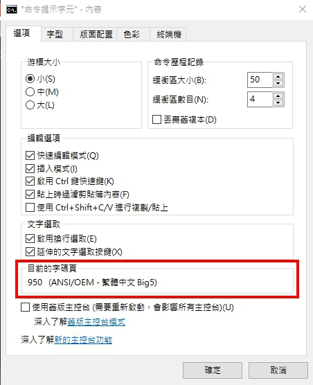

<center>
    Default Code Page
</center>

所以今天就來談談 Win 10 環境下，如何調整 Command Prompt / Windows Powershell 預設使用 UTF-8 編碼 。

## 臨時修改

```bash
> chcp 65001
```

僅調整**當下 Process**（Command Prompt / Windows Powershell）的字碼頁（CodePage）為 65001。

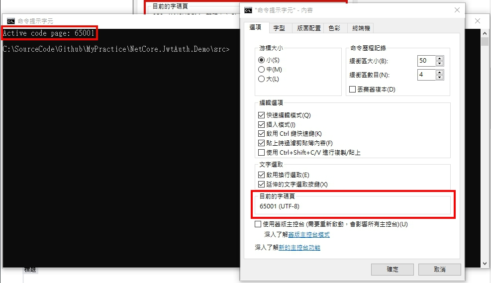

<center>
    CodePage 65001 now actived
</center>

## 永久修改

### Command Prompt

💭 [在命令提示視窗(Command Prompt)顯示UTF-8內容](https://blog.darkthread.net/blog/command-prompt-codepage/)

上文中有關 davidhcefx 的回覆解法，的確可以讓 Command Prompt 預設 UTF-8 編碼，而不用每次都還要改字碼頁，下面就稍微圖解一下：

1. Windows 搜尋 `regedit`
2. 前往 `HKEY_LOCAL_MACHINE\Software\Microsoft\Command Processor` 該位置
   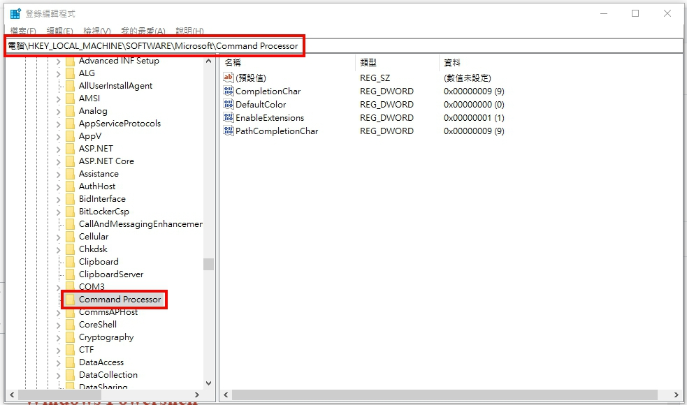
3. 於第二點提到之位置底下新增**字串值**，**數值名稱**為 **Autorun**，**數值資料**為 **chcp 65001>nul**
   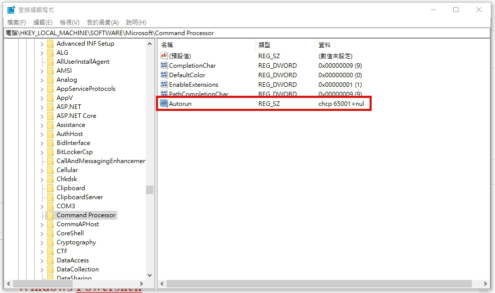

此時再次創建一個新的 Process，預設字碼頁就是 65001 了。

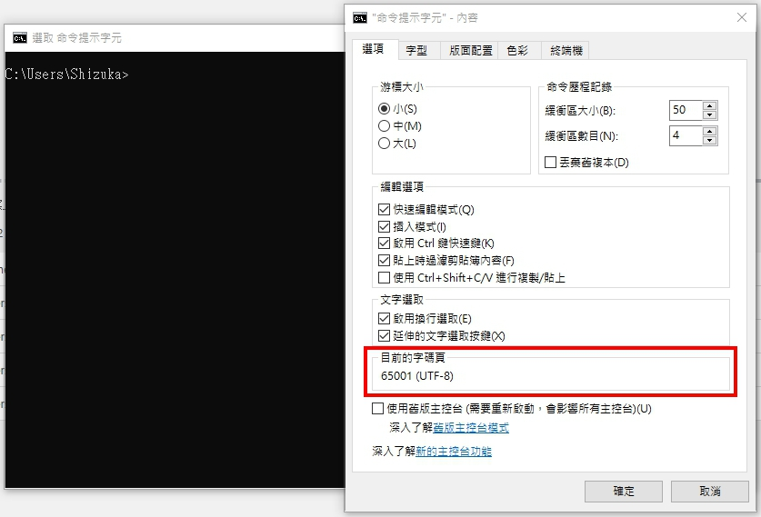

<center>
    CodePage 65001 now actived
</center>

### Windows Powershell

如果 Windows Powershell 要預設使用 UTF-8 編碼相比於 Command Prompt 就複雜得多… 畢竟微軟出品 (´\_ゝ`)

💭 [Using UTF-8 Encoding (CHCP 65001) in Command Prompt / Windows Powershell (Windows 10)](https://stackoverflow.com/questions/57131654/using-utf-8-encoding-chcp-65001-in-command-prompt-windows-powershell-window)

上文有比較詳細的討論，下面這邊就稍微圖解一下：

1. 確認 `[console]::OutputEncoding`、`[console]::InputEncoding`、`$OutputEncoding` 這些變數
   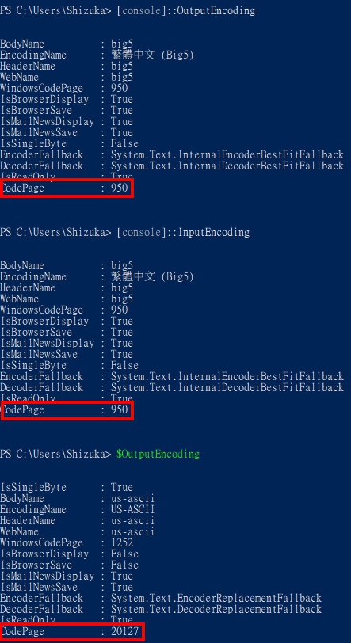
2. 確認 `$PROFILE` 變數
   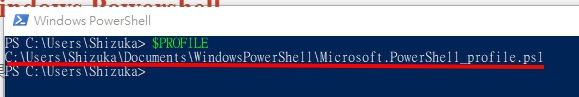
3. 新增 `Microsoft.PowerShell_profile.ps1` 至第二點提到之位置 `C:\Users\UserName\Documents\WindowsPowerShell` 底下
   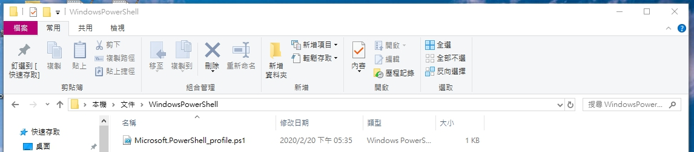
4. `Microsoft.PowerShell_profile.ps1` 內容如下：  
   _$OutputEncoding = [console]::InputEncoding = [console]::OutputEncoding = [Text.UTF8Encoding]::UTF8_
   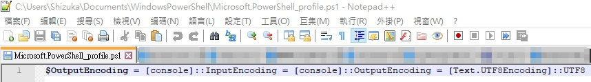

此時再次創建一個新的 Process，預設字碼頁就是 65001 了。

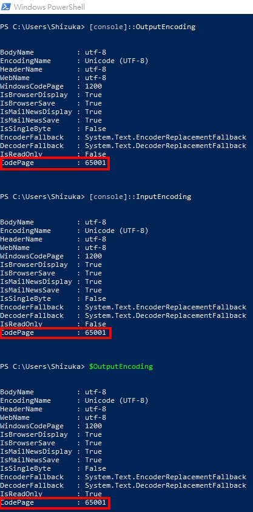

<center>
    CodePage 65001 now actived
</center>

回過頭來看 PowerShell 為什麼可以透過 Profile 檔案來客製化 Process 環境？其實也沒有什麼特別的原因，答案盡在 PowerShell 官方文件 [About Profiles](https://docs.microsoft.com/en-us/powershell/module/microsoft.powershell.core/about/about_profiles?view=powershell-7)，它設計上本來就可以利用 Profile 檔案來客製 Process 環境 ！

以上例來看，我僅**侷限在當前的登入者呼叫 PowerShell 要去幫我先跑 Profile 檔案**，若換了另一個登入者呼叫 PowerShell 就不會特別先去跑 Profile 檔案，因為另一位登入者並沒有照我們上述做了那些事情！

當然也可以預設讓所有登入者都去跑同一個 Profile 檔案，這部分就參考官方文件囉～

<center>
    ···
</center>

不過還有一件特別需要注意的事情，就是 PowerShell 在執行指令時要特別小心編碼問題！

💭 [PowerShell 執行非 .NET 程式在輸出資料時要注意編碼問題](https://blog.miniasp.com/post/2009/06/23/Unmanaged-Program-Out-File-Encoding-Problem-in-PowerShell)

你可能會覺得很奇怪？阿不是我們都調整好 UTF-8 編碼了嗎？

我創建了一個名為 test 的文字文件檔且編碼為 UTF-8，如下圖：

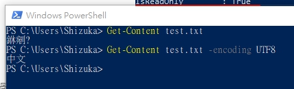

<center>
    WTF
</center>

如果沒特別給 encoding 參數，就會顯示亂碼，我也是覺得蠻黑人問號 (›´ω`‹ ) …

算是先留下一個洞，未來有再碰到類似問題，再回來解答吧～

## 結尾

感謝各位花時間看完此篇小文，如果本文中有描述錯誤，還請各位指教。

希望這篇文章可以解決掉大多數人對於 Command Prompt / Windows Powershell 預設使用 UTF-8 編碼的困擾哦◝( ﾟ∀ ﾟ )◟
