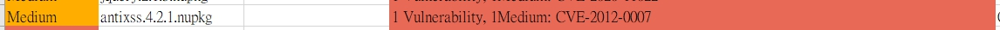

此篇文章主要帶大家**認識 .NET 各種 HtmlEncode 解決方案之間的比較**，有興趣就往下看吧！

## 前言

一般來說，為了避免網站應用程式被 [Cross-Site Scripting（XSS）](https://en.wikipedia.org/wiki/Cross-site_scripting)，我們都需要特別小心處理 HTML 裡面的內容，比較常見的手法會在 HTML 寫上 ``，而當使用者載入該頁面時，就會直接執行此段惡意程式碼，嚴重甚至導致自己的敏感資料外洩都有可能···

那有沒有辦法預防呢？有的，大部分解決方案會傾向透過 HtmlEncode 將 HTML 文件中不允許出現的字元進行編碼，通常會編碼 `<`、`>`、`&` 等字元，透過這樣子的處理可以大幅下降載入網頁時被執行惡意程式碼的可能性！

## 案例

    AntiXSS issue

最近在幫忙公司一個案子解有資安疑慮（XSS）的問題，而源碼檢測有找到一個中風險（Medium）的疑慮，就是該案子有使用到 [Microsoft Anti-Cross Site Scripting（AntiXSS）](https://www.nuget.org/packages/AntiXSS/)套件，源碼檢測報告中的描述如下：

> The Microsoft Anti-Cross Site Scripting (AntiXSS) Library 3.x and 4.0 does not properly evaluate characters after the detection of a Cascading Style Sheets (CSS) escaped character, which allows remote attackers to conduct cross-site scripting (XSS) attacks via HTML input, aka “AntiXSS Library Bypass Vulnerability.”
>
> From White Source Report

去查了一下這個套件最新釋出的版本是 4.3.0（最後更新日期為 2014/6/2），而且擁有者還是微軟 😂 ···

雖然報告中是描述 4.2.1 版本才有中風險疑慮，但**公司上層的決定比較偏向是需要根除專案內和此套件有依賴關係的程式碼**，因為確實專案使用此套件目的也只有需要 HtmlEncode 而已，所以只要找到一個合適的替代方案，就能讓專案和此套件解耦，站在後端工程師的角度，我也覺得是有必要的！

💥 但合適的替代方案，需要考量哪些因素呢 🤔？

這邊我會站在後端工程師的角度來帶你/妳看，為什麼我會這樣去選擇？

在那之前我們需要先評估一些現有的解決方案讓大家知道～

## 評估 HtmlEncode 各解決方案

.NET HtmlEncode 現有的一些解決方案可能如下幾個：

1. Encoder.HtmlEncode（AntiXSS）
2. Server.HtmlEncode
3. AntiXssEncoder.HtmlEncode
4. HttpUtility.HtmlEncode

**上述這些都可以解決你/妳 HtmlEncode 的需求，但若要以可長期維護來看，可能就要慎選了···**

## 分析 HtmlEncode 各解決方案可否長期維護性

這邊會依據上述提到的那些解決方案，逐一討論並做出一個合適的抉擇···

### Encoder.HtmlEncode（AntiXSS）

- 命名空間 (Namespace) : `Microsoft.Security.Application`
- 組件 (Assembly) : `AntiXssLibrary.dll`
- 範例 (Example) : `Encoder.HtmlEncode("")`
- 支援 (Support) : `沒特別相依在哪一個 .NET 框架上`
- 評語 : 雖然**沒有特別相依在哪一個 .NET 框架是一件好事**，但文章開頭就有說明**使用這個套件有一定風險存在**，而且多數客戶開始漸漸有意識到資訊安全的重要性，所以網站應用程式被弱掃的可能性很高，**等到被掃出來後再修改程式，倒不如一開始就不要裝，而且還可以減少對套件的依賴**，省時省錢又省力呢 😂 ···

### Server.HtmlEncode

- 命名空間 (Namespace) : `System.Web`
- 組件 (Assembly) : `System.Web.dll`
- 範例 (Example) : `Server.HtmlEncode("")`
- 支援 (Support) : `.NET Framework 4.8 ~ 3.5`
- 評語 : **早期 .NET Framework 網站應用程式的首選**，因 System.Web.Mvc 命名空間下的 Controller 類別有開出 Server 這一屬性（型態為 HttpServerUtilityBase），所以**透過繼承這個 Controller 類別的 MVC Controller 就可以直接使用 Server.HtmlEncode！**但**假設你/妳的網站應用程式未來有升版為 .NET 或 .NET Core 的打算，就不建議還在 .NET Framework 的時期就使用它**，因為未來你/妳還是需要找一個替代方案（ex. HttpUtility.HtmlEncode）😂 ···    

( PS. 可能有人會問在 System.Web.Http 命名空間下的 ApiController 為什麼沒辦法直接用 Server.HtmlEncode 呢？因為其實它就沒特別開 Server 這一屬性，起初我也以為 Server 這一屬性是 Controller 基本必備的，但後來看了一下開出的屬性跟方法，發現原來還是有差異存在··· )

### AntiXssEncoder.HtmlEncode

- 命名空間 (Namespace) : `System.Web.Security.AntiXss`
- 組件 (Assembly) : `System.Web.dll`
- 範例 (Example) : `AntiXssEncoder.HtmlEncode("", false)`
- 支援 (Support) : `.NET Framework 4.8 ~ 4.5`
- 評語 : **.NET Framework 4.5 之後額外的新選擇**，如果不特別去使用 Server.HtmlEncode 的話，但一樣**假設你/妳的網站應用程式未來有升版為 .NET 或 .NET Core 的打算，就不建議還在 .NET Framework 的時期就使用它**，因為未來你/妳還是需要找一個替代方案（ex. HttpUtility.HtmlEncode）😂 ···

## HttpUtility.HtmlEncode

- 命名空間 (Namespace) : `System.Web`
- 組件 (Assembly) : `System.Web.HttpUtility.dll`
- 範例 (Example) : `HttpUtility.HtmlEncode("")`
- 支援 (Support) : `.NET 5` `.NET Core 3.1 ~ 2.0` `.NET Framework 4.8 ~ 1.1` `.NET Standard 2.1 ~ 2.0`
- 評語 : 前面講那麼多，**最後就是來說服你/妳改使用 HttpUtility.HtmlEncode**，不得不說這個我也是最近才知道，知道得有點晚 Orz，總歸來說**它的優點就在於移植到新框架時，可以幾乎無痛升級**，也就是幾乎不用改你/妳當初寫的那些 HtmlEncode 程式碼，在新框架中它還是維持原樣，我想這是工程師樂見的！

## 總結

若你/妳的網站專案還在 `.NET Framework` 時期，建議以下做法：

1. 若**有使用到 AntiXSS 套件，建議不再使用它**（因為已多年無維護），更何況是有不依賴套件的做法存在，我們也不希望因為套件，讓我們的程式綁手綁腳，狠下心斷捨離就對了 😤 ···
2. 考量到**未來框架移植的可能**，將 Server.HtmlEncode & AntiXssEncoder.HtmlEncode 的寫法**汰換**為 HttpUtility.HtmlEncode 的寫法，未來移植時就可以少痛一點點 👍 ···

若你/妳的網站專案還在 `.NET Core` 時期，建議以下做法：

1. 若**有使用到 AntiXSS 套件，建議不再使用它**（因為已多年無維護），更何況是有不依賴套件的做法存在，我們也不希望因為套件，讓我們的程式綁手綁腳，狠下心斷捨離就對了 😤 ···
2. 相較於 .NET Framework 網站專案，.NET Core 本來就沒有 Server.HtmlEncode & AntiXssEncoder.HtmlEncode 的寫法，所以**如果不是特別使用坊間的一些套件，就建議一律改用 HttpUtility.HtmlEncode 的寫法**，未來移植時就可以少痛一點點 👍 ···

## 參考

💭 [AntiXSS](https://www.nuget.org/packages/AntiXSS/)

💭 [HttpServerUtilityBase](https://docs.microsoft.com/zh-tw/dotnet/api/system.web.httpserverutilitybase?view=netframework-4.8)

💭 [AntiXssEncoder](https://docs.microsoft.com/zh-tw/dotnet/api/system.web.security.antixss.antixssencoder?view=netframework-4.8)

💭 [HttpUtility](https://docs.microsoft.com/zh-tw/dotnet/api/system.web.httputility?view=netcore-3.1)
