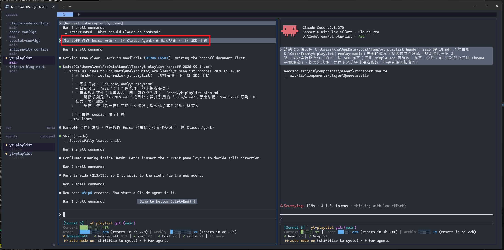
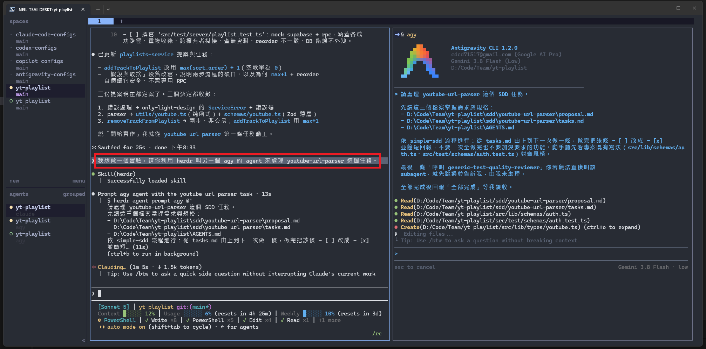
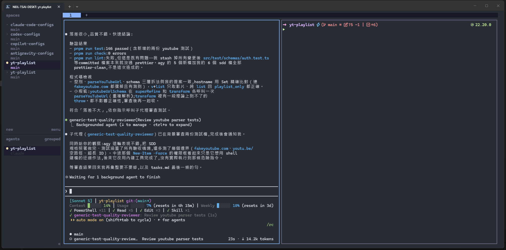

同時使用多種 AI 程式開發 Agent 之後，我遇到的問題已經不是「該選哪一個」，而是要怎麼管理它們。

Claude Code、Codex、GitHub Copilot CLI、Antigravity CLI 各有適合的工作，但當專案一多，終端機視窗也會跟著增加。哪一個 Agent 還在工作、哪一個正在等我確認，以及剛才的任務到底在哪個資料夾裡，逐漸變成另一種管理成本。

大約一個月前，我開始使用 Herdr。它沒有取代任何一個 Agent，卻改變了我組織這些工具的方式。

✨ **真正讓我留下來的原因，不只是可以少開幾個終端機，而是 Agent 之間終於可以開始交接工作。**

## Herdr 不是另一個 AI Agent

⚡ **Herdr 是一套為 AI 程式開發 Agent 設計的終端工作區管理工具。**

如果熟悉 tmux 或 Zellij，可以把它理解成類似的 terminal multiplexer：同一個工作環境裡可以建立 workspace、tab 和 pane，並讓終端程序在背景持續執行。

不同的是，Herdr 會辨識 pane 裡支援的 Agent，並在側邊欄顯示它目前是 `working`、`blocked`、`done` 還是 `idle`。目前官方列出的支援工具包含 Claude Code、Codex、GitHub Copilot CLI、Antigravity CLI 等。

但對第一次接觸 terminal multiplexer 的人來說，Herdr 沒有想像中難用。點擊 pane、拖曳邊界、切換 tab 和開啟選單等基本操作，都可以直接用滑鼠完成，不必先背下一整套快捷鍵。官方也將它定位為 mouse-first 的工具。

這點對我很重要。

我想要的是一個可以立即開始工作的環境，而不是安裝完之後，還要先花一段時間學習怎麼操作它。

## 一個月後，最有感的是這些小事

👍 **第一個讓我有感的功能，是 Agent 完成工作時會播放通知音效。**

這聽起來只是小功能，但當一個任務需要執行測試、整理大量檔案或等待背景 Agent 完成時，我不需要一直切回終端機確認進度。

Herdr 可以在背景 Agent 完成工作或需要輸入時發出通知，音效也能依完成與等待輸入分開設定。通知音效還可以針對不同 Agent 個別開啟或關閉。

就我使用過的工具來說，原生把這件事處理好的 Agent 工具並不多，Codex 是少數例子之一。Herdr 則把通知提升到整個工作區的層級，對支援狀態辨識的 Agent，都能用一致的方式掌握狀態。

👍 **另一個改變，是我不再需要記住每個專案該從哪個資料夾開始。**

Herdr 會保存 workspace、tab、pane、工作目錄與版面配置。重新開啟後，可以快速回到原本的專案位置。

平常關閉終端介面只是 detach，背景的 Agent、測試或開發伺服器仍會繼續執行；再次執行 `herdr` 就能連回去。官方文件對不同情況的保存範圍有完整說明。

不過這裡要區分兩種情況：一般 detach 不會停止原本的程序；如果電腦重新開機或 Herdr server 完整重啟，Herdr 主要會還原工作目錄與版面，任意程序不一定會原封不動地繼續執行。

😂 **即使如此，對日常開發而言，開機後不用逐一尋找專案目錄、重新安排視窗，已經省下不少切換成本。**

## 真正的關鍵，是 Agent 也能操作 Herdr

Herdr 最有意思的地方，不只是「人在同一個畫面打開多個 Agent」。

安裝 Herdr Skill 之後，Agent 本身也能透過 Herdr CLI 查看其他 pane、建立新的 pane、啟動另一個 Agent、傳送任務、等待完成並讀取輸出。這份 Skill 本質上是一份提供給 Agent 的操作指示，讓它知道如何在 Herdr 管理的環境裡安全地協調其他 Agent。

👍 **這讓原本需要我手動完成的切換動作，也能成為工作流程的一部分。**

### 案例一：用 `/handoff` 整理脈絡，再透過 Herdr 交棒

這個案例其實結合了兩種不同的能力。

我使用的 `/handoff` 並不是 Herdr 內建指令，而是來自 Matt Pocock 的 Skills 專案。它會把目前對話中仍在進行的工作、重要決策與下一步，整理成一份可攜帶的 Markdown 交接文件，讓新的 Agent 不必重新閱讀整段對話，也能接續工作。

Herdr 負責的則是後半段：建立新的 pane、啟動下一個 Agent，並請它讀取這份交接文件。

有一次，我先在目前的 Claude Agent 執行 `/handoff`，請它整理這一輪工作的內容。交接文件記錄了目前分支、已完成項目、待處理工作、專案規則，以及下一個 SDD 任務需要留意的事項。

文件完成後，Claude 再透過 Herdr Skill 檢查目前的 pane 配置，在右側建立新的 pane、啟動另一個 Claude Agent，並把交接文件的路徑交給它。新的 Agent 讀完文件後，便能直接接手下一階段的工作。



> `/handoff` 負責把工作脈絡整理成文件，Herdr 則負責建立工作空間並啟動接手的 Agent。

### 案例二：拆出單一任務，再交給另一個 Agent 審查

另一個案例中，我讓 Claude 將一個相對獨立的 `youtube-url-parser` SDD 任務交給 Antigravity CLI（啟動指令為 `agy`）處理。

Claude 先指定需求文件、任務清單和專案規則，要求 agy 依序完成工作，每完成一項就更新狀態，最後再回報結果。這個過程中，我仍然可以留在原本的 pane 繼續與 Claude 對話。



> 左側的 Claude 負責協調，右側的 agy 處理被拆分出來的單一任務。

實作完成後，我再透過 Claude Code 執行自己撰寫的測試品質審查子代理。這一步使用的是 Claude Code 的子代理機制；Herdr 負責的是前面的跨 pane 任務交接。主要 Agent 等待審查子代理完成，再彙整測試結果與可修正的問題。



> 實作者與審查者可以由不同 Agent 負責，主要 Agent 則等待並整理結果。

這種做法不一定是為了讓所有 Agent 同時高速運轉。

它更像是把責任切清楚：

- 一個 Agent 負責規劃與協調
- 一個 Agent 負責完成範圍明確的實作
- 另一個 Agent 負責測試或程式碼審查
- 最後由主要 Agent 整理結果，交回給我確認

當任務邊界清楚時，不同 Agent 才是真的在協作，而不是同時修改同一批檔案。

## Windows 安裝 Herdr

我目前是在 Windows 與 PowerShell 環境使用 Herdr。

依照官方安裝文件，可以在 PowerShell 執行：

```powershell
powershell -ExecutionPolicy Bypass -c "irm https://herdr.dev/install.ps1 | iex"
```

安裝完成後，先確認版本：

```powershell
herdr --version
```

接著進入專案目錄並啟動 Herdr：

```powershell
cd "你的專案路徑"
herdr
```

Herdr 會依目前目錄建立或開啟 workspace。之後便能在 pane 裡正常執行原本使用的 Agent，例如：

```powershell
claude
```

或：

```powershell
codex
```

### 別忽略 PowerShell 5.1 與 PowerShell 7 的差異

Windows 上還有一個容易誤判成安裝問題的地方。

依目前官方文件，Windows 上的 Herdr 預設會優先使用 PATH 中的 `pwsh.exe`（PowerShell 7），找不到時才退回系統內建的 `powershell.exe`（Windows PowerShell 5.1）。

如果進入 Herdr 後發現 Oh My Posh 樣式、profile 或指令行為與平常不同，可以先確認：

```powershell
$PSVersionTable.PSVersion
$PROFILE
```

若希望 Herdr 固定使用 PowerShell 7，可編輯：

```text
%APPDATA%\\herdr\\config.toml
```

加入：

```toml
[terminal]
default_shell = "pwsh.exe"
```

再重新載入設定：

```powershell
herdr server reload-config
```

既有 pane 不會自動更換 shell，需要關閉後重新建立。這項行為與官方的 terminal 預設設定說明一致。

### 安裝 Herdr Skill

如果只想把 Herdr 當成終端工作區，安裝到這裡就能開始使用。

但如果希望 Agent 可以自行建立 pane、啟動其他 Agent、讀取輸出或等待工作完成，建議再安裝 Herdr Skill：

```powershell
npx skills add herdrdev/herdr --skill herdr -g
```

安裝後，需在 Herdr 的 pane 裡啟動 Agent，讓它取得 `HERDR_ENV=1` 環境變數，再提出這類要求：

```text
請在右側建立一個 pane，啟動 Codex 檢查目前的 diff，完成後整理可修正的問題。
```

Skill 不會讓 Agent 自動展開工作，也不代表 Agent 可以任意操作所有 pane。它提供的是操作 Herdr 的能力，真正的任務範圍、工作目錄、角色與完成條件，仍然需要由使用者說清楚。

## 只使用一種 Agent，也值得用嗎？

我認為值得，但使用方式會不同。

如果平常只使用 Codex 或 Claude Code，Herdr 仍然可以提供幾個很直接的好處：

- 保存不同專案的 workspace 與工作目錄
- 用 tab 和 pane 分開 Agent、測試、開發伺服器與記錄
- 在 Agent 完成或等待輸入時收到通知
- 關閉終端介面後，讓背景工作繼續執行
- 在同一種 Agent 之間切分實作、測試與審查工作

Herdr 啟動 Agent 時，也可以把 `--` 後面的參數傳給 Agent。因此，即使只使用同一套工具，仍然可以讓不同 pane 採用不同模型或啟動設定。官方文件提供了完整的啟動、提示、等待與讀取輸出方式。

不過，如果平常只是偶爾開啟 Agent、問一個短問題，完成後立刻關閉，而且沒有多專案、背景程序或長時間任務，那麼 Herdr 帶來的改善可能有限。

✨ **它真正有價值的時刻，是工作開始出現「狀態」之後：有幾個專案需要切換、有 Agent 正在背景執行、有任務等待確認，或開始需要把工作交給下一個 Agent。**

## 從管理視窗，走向管理工作

剛開始使用 Herdr 時，我只是想少開幾個終端機視窗。

一個月後，我覺得它更重要的價值，是讓原本分散在不同 Agent 裡的工作，開始具備可以觀察、交接與協調的結構。

你不需要一開始就建立複雜的多 Agent 流程。可以先從最單純的方式開始：替不同專案建立 workspace，用 pane 分開 Agent 與測試，讓通知音效提醒你工作已完成。

等熟悉之後，再試著把一個範圍明確的任務交給另一個 Agent，或讓獨立的審查 Agent 負責檢查結果。

🔥 **Herdr 沒有替我決定該怎麼分工，但它讓這些過去很麻煩的工作方式，變成一句指令就能開始嘗試的事情。**

而這也是我使用一個月後，仍然願意繼續把它留在日常工作流程裡的原因。

## 參考

💭 [Herdr documentation](https://herdr.dev/docs/)：工具定位與 mouse-first 操作方式。

💭 [Agents](https://herdr.dev/docs/agents/)：支援工具與 Agent 狀態辨識。

💭 [Sound](https://herdr.dev/docs/configuration/#sound)：通知音效與個別 Agent 的設定。

💭 [Session state and restore](https://herdr.dev/docs/session-state/)：detach、server 重啟與狀態還原的差異。

💭 [Agent skill file](https://herdr.dev/docs/agent-skill/)：Herdr Skill 的安裝方式、操作能力與執行環境要求。

💭 [Matt Pocock 的 handoff Skill](https://github.com/mattpocock/skills/blob/main/docs/productivity/handoff.md)：交接文件的用途與使用方式。

💭 [Install Herdr](https://herdr.dev/docs/install/)：Windows 安裝與版本確認。

💭 [Terminal defaults](https://herdr.dev/docs/configuration/#terminal-defaults)：預設 shell 的選擇與既有 pane 的行為。

💭 [Agent automation](https://herdr.dev/docs/agent-automation/)：Agent 啟動、參數傳遞、等待與輸出讀取。
