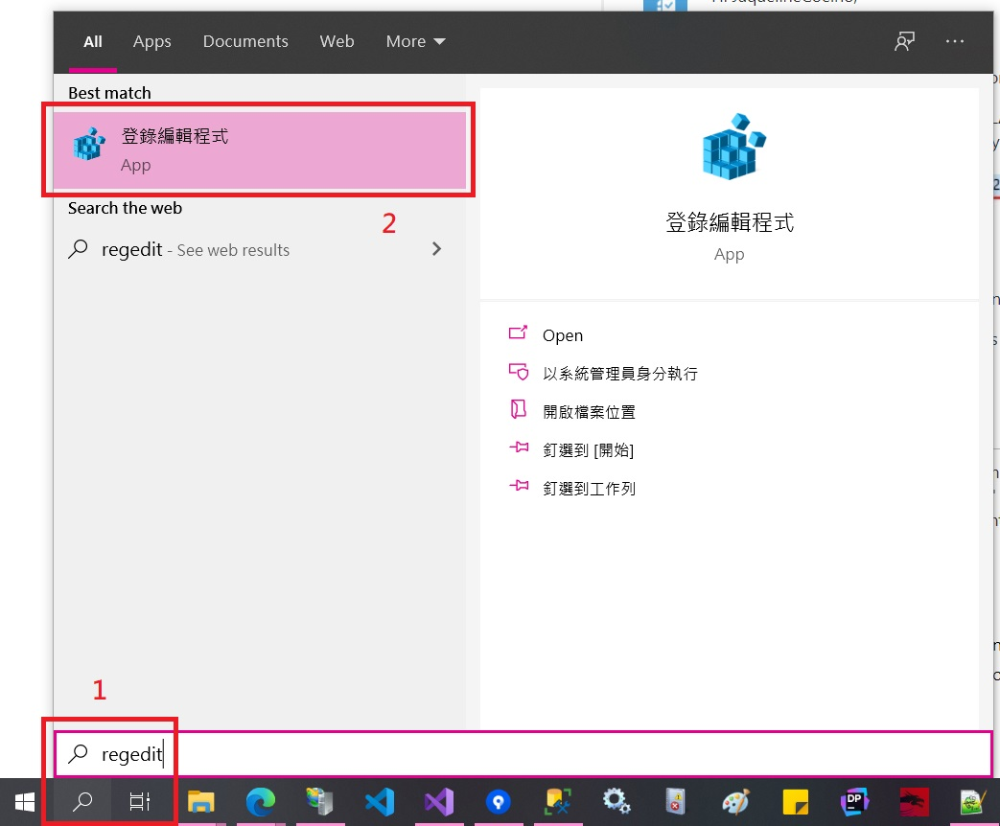
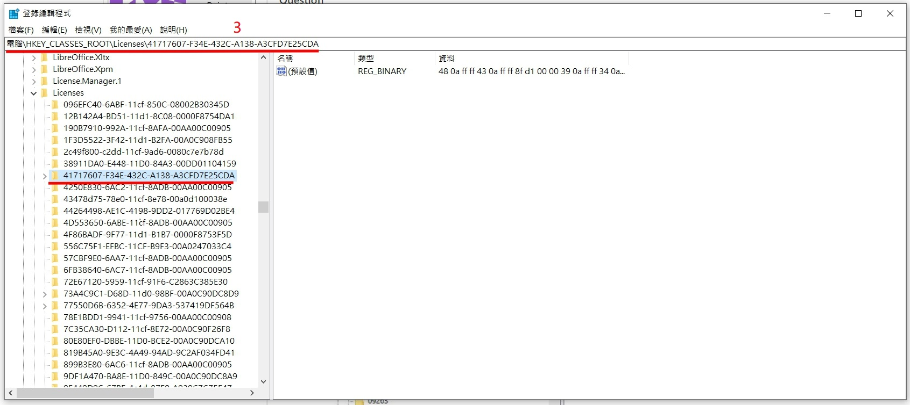
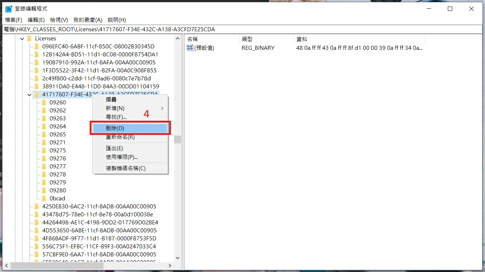
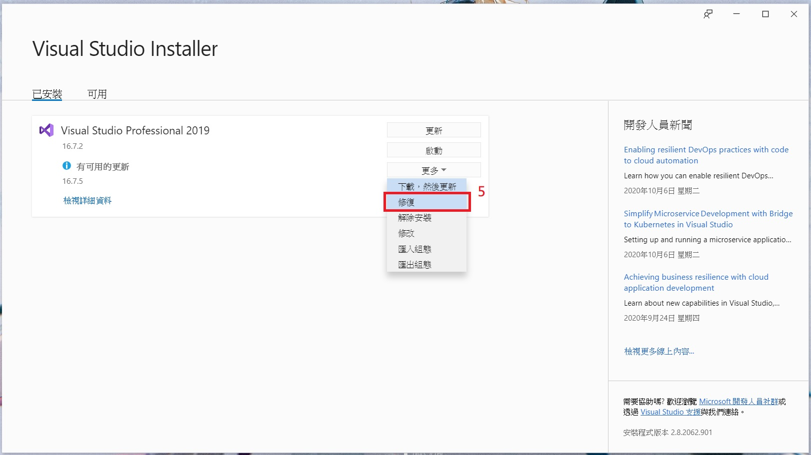
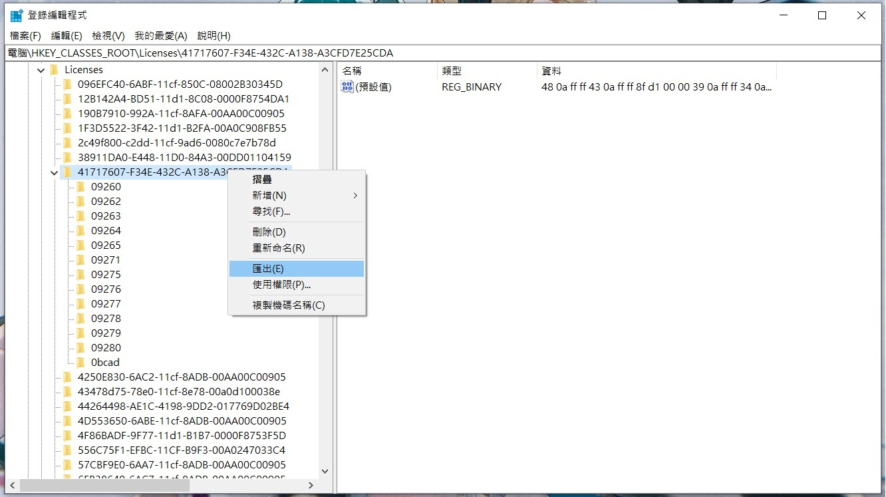

此篇文章主要帶大家**以不重灌系統前提下讓 Visual Studio 2019 可以重新輸入授權金鑰**，有興趣就往下看吧！

## 前言

你/妳一定會覺得奇怪，怎麼會有人有文章標題的需求呢？**就還真的是有 😂 ···**

我們先假設一種情形：

1. 身分是工程師
2. 未特別向公司申請開發工具授權，而是隨意使用網路上存在的任意授權（不用說得很明白吧 😂）
3. 公司臨時要外部稽核

如果碰到上述情況，就變成需要配合公司政策走，也就是需要向公司申請開發工具授權···等等（正常來說也應該都是用公司授權，如果公司有買的話）···

❗ **但我這邊要鄭重說明，我並不是鼓勵大家去使用網路上的任意授權，如果有能力的話，還是盡量都走正規管道取得授權並去使用！**

所以寫這篇文章，主要是幫助那些曾經走歪路的，可以導回正軌哦 😂 ···

## 前情提要

相信大家看到上圖，應該都不陌生，就是當你安裝完 Visual Studio 後會有的試用期啦···

然後當你選擇**使用產品金鑰解除鎖定**時，就會**寫授權進入註冊表中**，所以**之後你幾乎無法透過已有介面來重新輸入授權**，等到需要轉換授權時，就會很頭痛 😩 ···

所以可能就要變相使用一些手段來改變授權碼，這邊提供一個可以用指令換掉授權的可能方式給大家參考，但跟我今天要說明的倒是沒太大關係···

💭 [Automatically apply product keys when deploying Visual Studio](https://docs.microsoft.com/en-us/visualstudio/install/automatically-apply-product-keys-when-deploying-visual-studio?view=vs-2019)

## 實際做法

### 不重灌作業系統前提下

為了 Visual Studio 2019 可以重新輸入授權，而要重灌作業系統，怎麼想都覺得累 😩 ···

那接下來就一步一步跟著做吧！

1. `Windows` 搜尋 `regedit`
   
2. 搜尋 `HKEY_CLASSES_ROOT\Licenses\41717607-F34E-432C-A138-A3CFD7E25CDA`
   
3. 刪除它
   
4. 打開 `Visual Studio Installer` 找到你的 `Visual Studio 2019` 並**修復（repair）**它
   
5. 待修復完畢後，打開 `Visual Studio 2019` 應該又能**重新手動輸入授權**了哦
   
   
❗ 不過刪除之前，建議可以先把 `HKEY_CLASSES_ROOT\Licenses\41717607-F34E-432C-A138-A3CFD7E25CDA` 備份起來，養成備份的好習慣···

### 重灌系統前提下

就···是重灌系統，沒什麼好說的···

但工程師應該會心力交瘁，畢竟要把那些開發工具、環境都要重新搞一遍，**這做法不實際，但這也是最後手段 😂 ···**

## 參考

💭 [How do I remove a license from Visual Studio 2019?](https://social.msdn.microsoft.com/Forums/en-US/3371f1fc-1724-4005-ae47-8497c06aa739/how-do-i-remove-a-license-from-visual-studio-2019?forum=vssetup)

💭 [How to remove product key form visual studio 2017 professional .](https://social.msdn.microsoft.com/Forums/vstudio/en-US/18e79979-806b-4f93-a063-a30b5125f868/how-to-remove-product-key-form-visual-studio-2017-professional-?forum=visualstudiogeneral)