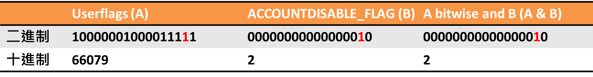
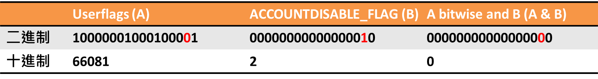

此篇文章主要帶大家**利用 .NET 透過 System.DirectoryServices 套件來確認 Windows 使用者是否為啟用狀態**，有興趣就往下看吧！

## 前言

最近在公司處理到一張蠻特別的單子，需求大致上是需要去**尋覽出客戶機器上那些已被啟用的 Windows 使用者，然後取得那些使用者的資訊（ex. 使用者名稱）去做一些後續處理**，於是乎我在茫茫網路海中找到了一個普遍的做法，但我實在有點好奇它的運作方式，便促使了這篇文章的誕生，希望也可以幫助到你/妳···

## 範例

### 大致步驟

1. 透過 `nuget` 取得 `System.DirectoryServices` 套件
2. 透過 `System.DirectoryServices` 操作 `Active Directory Service Interface（ADSI）`

### 程式碼

```csharp
// WindowsOperateHelper.cs

using ActiveDirectoryOperateCore.Enum;
using System;
using System.Collections.Generic;
using System.DirectoryServices;
// 略...

// Account disable flag
private const int ACCOUNTDISABLE_FLAG = (int)AdsUserFlag.ADS_UF_ACCOUNTDISABLE;

/// <summary>
/// Get actived windows user directory entries
/// </summary>
/// <returns></returns>
public static List<DirectoryEntry> GetWindowsActiveUserDirectoryEntries()
{
    List<DirectoryEntry> directoryEntries = new List<DirectoryEntry>();

    // Get local machine directory entry
    DirectoryEntry localMachineDirectoryEntry = new DirectoryEntry("WinNT://" + Environment.MachineName);

    foreach (DirectoryEntry childDirectoryEntry in localMachineDirectoryEntry.Children)
    {
        // Focus user directory entry
        if (childDirectoryEntry.SchemaClassName == "User")
        {
            var userflags = (int)childDirectoryEntry.Properties["UserFlags"].Value;

            // If userflags bitwise and accountDisableFlag equal two, mean this windows user state is inactive
            if ((userflags & ACCOUNTDISABLE_FLAG) != ACCOUNTDISABLE_FLAG)
            {
                directoryEntries.Add(childDirectoryEntry);
            }
        }
    }

    return directoryEntries;
}
```

```csharp
// Program.cs

using ActiveDirectoryOperateCore.Helper;
using System;
using System.Linq;
// 略...

/// <summary>
/// Display actived windows user names
/// </summary>
private static void DisplayWindowsActiveUserNames()
{
    // Get actived windows user names
    var windowsActiveUserNames =
        WindowsOperateHelper.GetWindowsActiveUserDirectoryEntries()
                            .Select(windowsActiveUserDirectoryEntry => windowsActiveUserDirectoryEntry.Name);

    foreach (var windowsActiveUserName in windowsActiveUserNames)
    {
        Console.WriteLine(windowsActiveUserName);
    }
}
```

🤔 雖然參考了他人的程式碼，但我這邊還是盡可能改成我覺得比較好維護的方式供各位參考！

1. 將 ADS_USER_FLAG 抽去 Enum
2. 將 WindowsOperateHelper 抽去 .NET Standard 專案（可以兼容 .NET Framework 和 .NET Core 應用）

[範例專案](https://github.com/cdcd72/ActiveDirectoryOperations.Demo)可參考···

### 參考來源

💭 [Get a list of active local users with .NET](http://blog.bitcollectors.com/adam/2011/10/get-a-list-of-active-local-users/)

💭 [ADS_USER_FLAG_ENUM enumeration](https://docs.microsoft.com/en-us/windows/win32/api/iads/ne-iads-ads_user_flag_enum)

## 了解 Active Directory Service Interface

看完上面的範例程式碼後，是不是開始好奇為什麼透過 System.DirectoryServices 可以取得 Active Directory 的資訊呢 🤔！？

但在那之前，還需要先了解 **Active Directory Service Interface（ADSI）**是什麼？為什麼我們需要透過 ADSI 來操作 Active Directory？

> Active Directory Service Interface（ADSI）是一組基於 COM 技術上的應用程式開發介面，程式開發人員可以利用這些介面來連接並存取 Active Directory 執行查詢，更新或刪除等管理功能，ADSI 同時可支援以 LDAP（輕量級目錄存取協定）為主的目錄服務（例如 Novell Directory Service），以及以 Windows NT 網域為主所組成的 WinNT 網域目錄。
>
> [Active Directory Service Interface from wikipedia](https://zh.wikipedia.org/wiki/Active_Directory_Service_Interface)

基本 wiki 的描述幾乎已經解答完什麼是 ADSI 了，所以我就不再多描述了，建議如果想要深入了解的人，一定要看看 wiki 的完整內容 😜！

## 了解 System.DirectoryServices

了解 ADSI 後，可能你/妳就清楚為什麼當初 .NET Framework 另外提供了一顆專門操作 ADSI 的元件（元件目前已經有支援 .NET Standard 2.0），大概可以知道他們有以下幾點考量：

1. 尽可能簡化開發人員操作 ADSI 的難度
2. 有一點 Facade 的味道，讓原本不易理解的原生介面（Native interfaces）換上新外觀（多墊一層）
3. 因這些原生介面被 System.DirectoryServices 封裝關係，所以可以減少應用程式對於 ADSI 這些原生介面的依賴程度

💭 [System.DirectoryServices](https://www.nuget.org/packages/System.DirectoryServices/)

## Userflags 和 ADS_USER_FLAG 的關係

啊啊！拉回來探討主題，不小心扯到太遠了，好奇心真可怕 😜

❓ **那為什麼利用 Userflags 和 ADS_USER_FLAG 就有辦法確認 Windows 使用者的啟用狀態呢！？**

先稍微回顧一下當初下判斷的地方，如下：

```csharp
var userflags = (int)childDirectoryEntry.Properties["UserFlags"].Value;

// If userflags bitwise and accountDisableFlag equal two, mean this windows user state is inactive
if ((userflags & ACCOUNTDISABLE_FLAG) != ACCOUNTDISABLE_FLAG)
{
    // 略..
}
```

這邊會稍微逐步去解析為什麼需要下這樣的判斷，先了解下表意義：



<center>
    Windows user state is inactive
</center>

假如今天把 Userflags 和 ACCOUNTDISABLE_FLAG 做 & 運算（bitwise and）後得出的結果為 2 的話，剛好等於 ADS_UF_ACCOUNTDISABLE 所定義的結果，所以我們可以認為該名 Windows 使用者目前為停用狀態···



<center>
    Windows user state is active
</center>

假如今天這名使用者的 Userflags 變為 66081（十進位）時，則代表這名使用者的狀態已被更改為啟用狀態！

<center>
    ···
</center>

Userflags 加上 2 對於二進位來說，從右往左數第二位如果是 1 的話就會往前進位，接著只要與 2 做 & 運算一定就會為 0，當初我也是想破頭，才知道為什麼要這麼做···（要是被大學老師知道，肯定被宰 😂···

🌟 **總結來說，其它 ADS_USER_FLAG 也可以用相同方式來做判斷！**

❗ **另外要注意的是 Userflags 是系統會控制，請以它為基準去判斷，若有人為加工情形，就有誤判的可能 🤔···**

## 額外參考

💭 [Active Directory](https://zh.wikipedia.org/wiki/Active_Directory)

💭 [How to use the UserAccountControl flags to manipulate user account properties](https://support.microsoft.com/en-us/help/305144/how-to-use-useraccountcontrol-to-manipulate-user-account-properties)

## 結尾

感謝各位花時間看完此篇文章，如果本文中有描述錯誤，還請各位指教。

從需求的理解到實務上的處理，發現真的是一個坑比一個坑大，雖然今天介紹的部分我自認為沒有算非常詳細，但應該可以幫助到你/妳去了解實務上大概要如何去操作 Active Directory！

System.DirectoryServices 也已經有支援 .NET Standard，所以不管是現在還在開發 .NET Framework 或者是 .NET Core 應用程式的工程師，都可以善加利用 .NET Standard 的特性來幫助自己寫出更好維護的專案結構！