此篇文章主要以**自身專案情況將 .NET Core 2.1 升版至 3.1 哦**，有興趣就往下看吧！

## 為什麼需要升版？

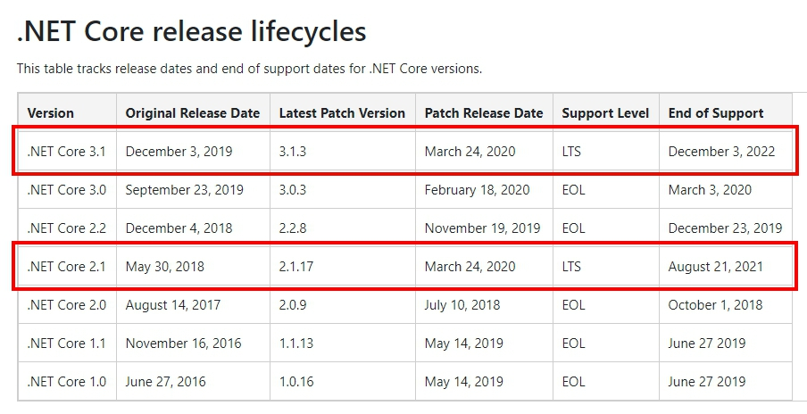

<center>
    .NET Core release lifecycles
</center>

從官方核心支援政策可以看出，目前仍長期支援（LTS）的版本有：

- .NET Core 3.1（2022 年 12 月 3 日停止支援）
- .NET Core 2.1（2021 年 8 月 21 日停止支援）

雖然目前仍然可以繼續使用 .NET Core 2.1 沒什麼問題，但是既然有新版本釋出，幹嘛不用呢 σ`∀´)σ···

其實最主要是因為 .NET Core 3.0 以後的版本釋出了許多新特性，另一方面則是大幅簡化程式碼撰寫量，像是有些在 .NET Core 2.X 的程式碼都已經被包進了官方套件中···

👋 Worker Service 就是 .NET Core 3.0 之後才有的新應用，可以參考我寫的「[Worker Service 長時間服務託管｜.NET Core 3 新功能](/posts/net-core-3-to-implement-worker-service)」去了解哦···

🌟 當然有另外一部份原因是為了未來的 .NET 5 做好準備，官方也已經釋出了 [.NET 5 Preview 1 版本](https://devblogs.microsoft.com/dotnet/announcing-net-5-0-preview-1/)，當中也提到了他們將會盡量減輕從 .NET Core 3.1 升版 .NET 5 的負擔，開發人員聽到這個應該無一不興奮吧😆···

💭 [.NET Core Support Policy](https://dotnet.microsoft.com/platform/support/policy/dotnet-core)

## 升版準備及建議

### 準備

1. Visual Studio 2019
2. .NET Core SDK（例如我只要從 2.1 升到 2.2，那我需要準備好 .NET Core SDK 2.2 或者更高版本 SDK）

### 建議

❗ **逐步升版**是比較好的選擇哦，如下圖箭頭指示：

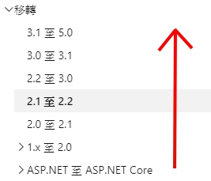

<center>
    .NET Core migrate
</center>

以我的例子來看，我要從 2.1 升版至 3.1，那我需要做以下 3 步（由上至下）：

- [ASP.NET Core 2.1 遷移至 2.2](https://docs.microsoft.com/en-us/aspnet/core/migration/21-to-22?view=aspnetcore-3.1&tabs=visual-studio)
- [ASP.NET Core 2.2 遷移至 3.0](https://docs.microsoft.com/en-us/aspnet/core/migration/22-to-30?view=aspnetcore-3.1&tabs=visual-studio)
- [ASP.NET Core 3.0 遷移至 3.1](https://docs.microsoft.com/en-us/aspnet/core/migration/30-to-31?view=aspnetcore-3.1&tabs=visual-studio)

這樣的好處是比較不會手忙腳亂，而且也可以順便看看升版前後究竟在架構上有什麼樣的變化哦！

### 實際演練

當時的準備情況：

1. Visual Studio 2019
2. .NET Core SDK 3.1

#### 2.1 → 2.2

以我的例子來看，我的方案（Solution）有三個專案（Project），這些專案均要升版至 2.2，整體來說才真正升版為 .NET Core 2.2···

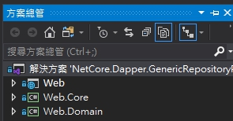

<center>
    Solution structure
</center>

先觀察一下這些專案檔···

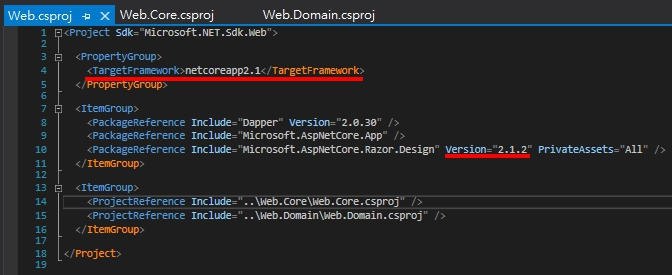

<center>
    Web.csproj
</center>

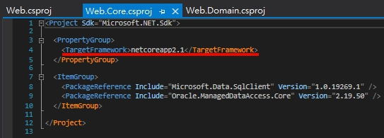

<center>
    Web.Core.csproj
</center>

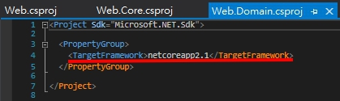

<center>
    Web.Domain.csproj
</center>

可以觀察出幾點：

- TargetFramework 為 netcoreapp2.1
- 官方套件版本均為 2.1.2

❗ 若要讓專案升版為 .NET Core 2.2，則需將 TargetFramework 改為 netcoreapp2.2，然後官方套件版本均要改為 2.2.0！

當然也可以透過對專案右鍵 ➡️ 屬性 ➡️ 修改目標 Framework 為 .NET Core 2.2：

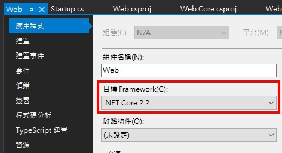

<center>
    Project Attribute
</center>

改完之後應該會如下這樣：

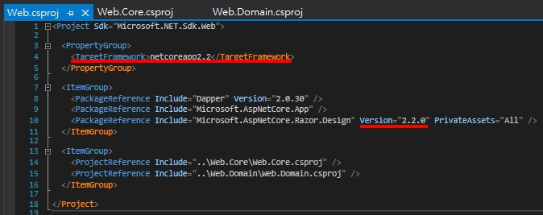

<center>
    Web.csproj
</center>


<center>
    Web.Core.csproj
</center>


<center>
    Web.Domain.csproj
</center>

接著調整相容性版本為 2.2，若專案屬於 .NET Core 2.X 比較需要在意這件事哦！

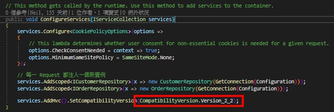

<center>
    Set compatibilityVersion to 2.2
</center>

關於相容性版本疑問可以參考下方連結，敘述的較為詳細，這邊就不多做描述了···

💭 [What is SetCompatibilityVersion inside of the startup class of asp.net Web API core project](https://stackoverflow.com/questions/54193865/what-is-setcompatibilityversion-inside-of-the-startup-class-of-asp-net-web-api-c)

以上做完，應該就順利升為 .NET Core 2.2 了！

<center>
    ···
</center>

此時你應該會想跑一下應用程式是否如以往正常，但是😱···

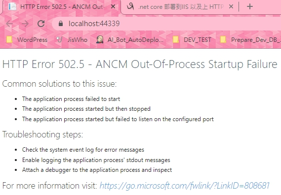

<center>
    HTTP Error 502.5 – ANCM Out-Of-Process Startup Failure
</center>

別慌！先試試下面命令：

```bash
dotnet --list-runtimes
```

輸出如下：

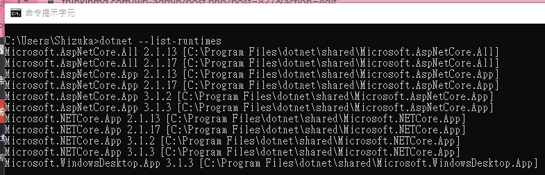

<center>
    Output
</center>

有發現了嗎？原來是我沒有安裝 .NET Core Runtime 2.2 的關係，導致沒辦法運行以 .NET Core 2.2 為基底的應用程式 ( ×ω× )···

💭 [HTTP Error 502.5 – ANCM Out-Of-Process Startup Failure (Windows Server)](http://docs.lacunasoftware.com/en-us/articles/amplia/on-premises/windows/troubleshoot/502-5.html)

👏 第 1 步完工啦！

#### 2.2 → 3.0

2.1 升版至 2.2 其實修改的內容不多，蠻容易的···

但從 2.2 升版至 3.0 變化會稍微大一點，但照表操課還是能一一解決，讓我們開始吧！

一樣先來修改專案檔···

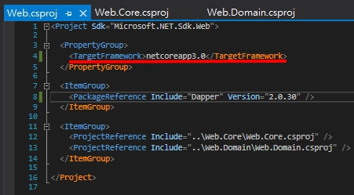

<center>
    Web.csproj
</center>

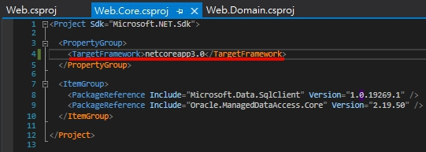

<center>
    Web.Core.csproj
</center>

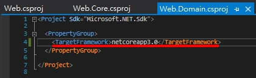

<center>
    Web.Domain.csproj
</center>

❗ 若要讓專案升版為 .NET Core 3.0，則需將 TargetFramework 改為 netcoreapp3.0，然後眼尖的你可能會發現怎麼官方套件被消失了😱···

別慌！先看看文件：

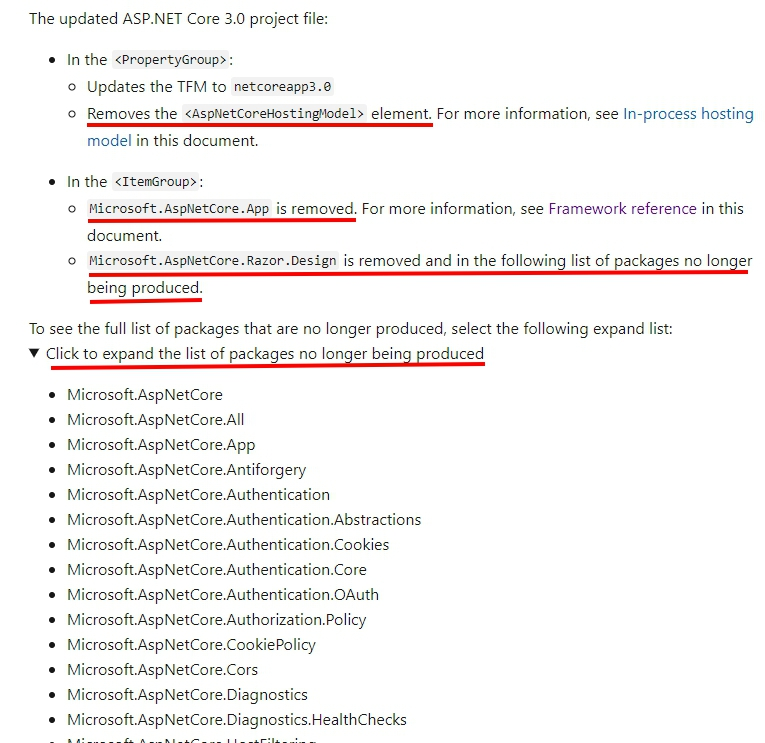

<center>
    Microsoft docs
</center>

其實文件就有說明需要移除的官方套件有哪些哦！所以刪下去就對啦···

<center>
    ···
</center>

接著來改 `Startup.cs`···

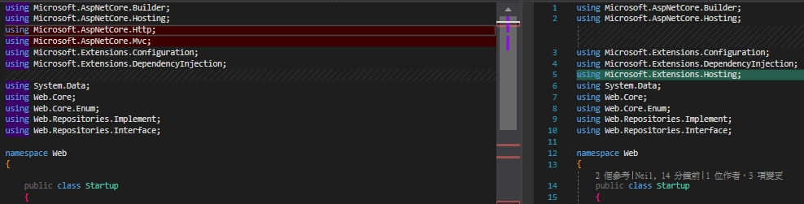

<center>
    Include
</center>

❌ 移除 `Microsoft.AspNetCore.Mvc`

✔️ 增加 `Microsoft.Extensions.Hosting` 以便可以繼續使用 `env.IsDevelopment()`

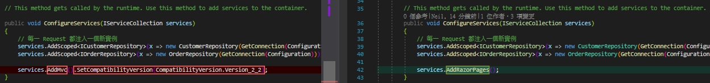

<center>
    ConfigureServices
</center>

✔️ 更改 `services.AddMvc()` 為 `services.AddRazorPages()`

💭 [MVC service registration](https://docs.microsoft.com/en-us/aspnet/core/migration/22-to-30?view=aspnetcore-3.1&tabs=visual-studio#mvc-service-registration)

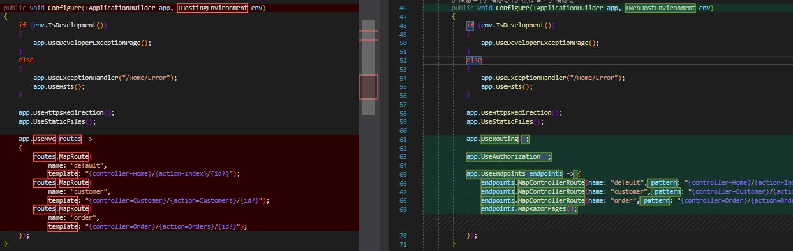

<center>
    Configure
</center>

✔️ 更改 `IHostingEnvironment` 為 `IWebHostEnvironment`

✔️ 增加 `app.UseRouting()`

💭 [Routing in ASP.NET Core](https://docs.microsoft.com/en-us/aspnet/core/fundamentals/routing?view=aspnetcore-3.1)

✔️ 增加 `app.UseAuthorization()`

💭 [ASP.NET Core Middleware](https://docs.microsoft.com/en-us/aspnet/core/fundamentals/middleware/?view=aspnetcore-3.1)

✔️ 使用 `app.UseEndpoints()`

<center>
    ···
</center>

接著來改 `Program.cs`···

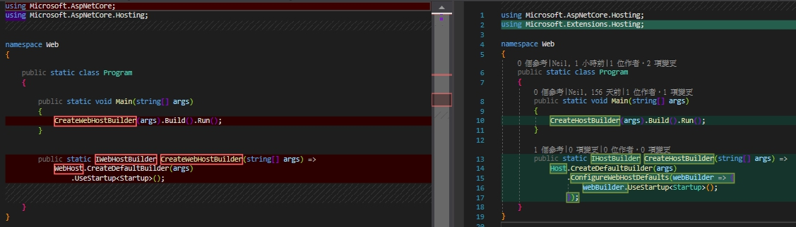

<center>
    CreateHostBuilder
</center>

✔️ 更改 `IWebHostBuilder` 為 `IHostBuilder`

❗ ❗ ❗ **額外提醒** ❗ ❗ ❗

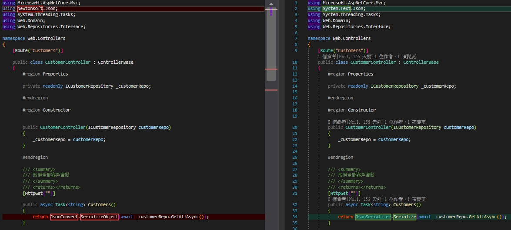

<center>
    System.Text.Json
</center>

❗ **.NET Core 3.0 開始官方移除了對 Newtonsoft.Json 的依賴，而改預設使用 [System.Text.Json](https://docs.microsoft.com/en-us/dotnet/api/system.text.json) 做為 JSON 序列器···**

System.Text.Json 效能上比 Newtonsoft.Json 更好也更加嚴謹，但目前可以處理的事情沒有比 Newtonsoft.Json 多，但基本的序列化跟反序列化是沒問題地，因為它還在發展中，但可以預期的是未來 System.Text.Json 廣泛被使用程度會超越 Newtonsoft.Json，值得學習使用看看哦！

💭 [How to migrate from Newtonsoft.Json to System.Text.Json](https://docs.microsoft.com/en-us/dotnet/standard/serialization/system-text-json-migrate-from-newtonsoft-how-to#case-insensitive-deserialization)

👏 第 2 步完工啦！

#### 3.0 → 3.1

3.0 升版至 3.1 問題不大，蠻容易的···

一樣先來修改專案檔···

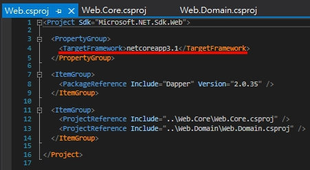

<center>
    Web.csproj
</center>

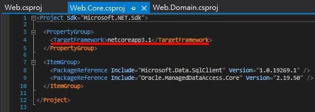

<center>
    Web.Core.csproj
</center>

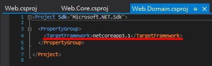

<center>
    Web.Domain.csproj
</center>

❗ 若要讓專案升版為 .NET Core 3.1，則需將 TargetFramework 改為 netcoreapp3.1，然後以我的情況來看就改這樣，沒了😂···

👏 第 3 步完工啦！

## 心得

不得不說 .NET Core 的進程非常快速，前年才釋出 .NET Core 2.1，去年就釋出了 .NET Core 3.1，畢竟若大家有能力的話，也都可以去改 [dotnet/core](https://github.com/dotnet/core)，我想這就是大家努力共同產生的結果吧！

整體來說從 .NET Core 2.1 升版至 3.1 不困難，因為官方文件整理得蠻詳細了，但**建議看英文版文件**，中文看起來應該就是機翻出來的，可能要通靈一下😂···

最後在提醒一下，這篇文章主要是以我自身專案狀況來描述，但基本上不會差太多哦！