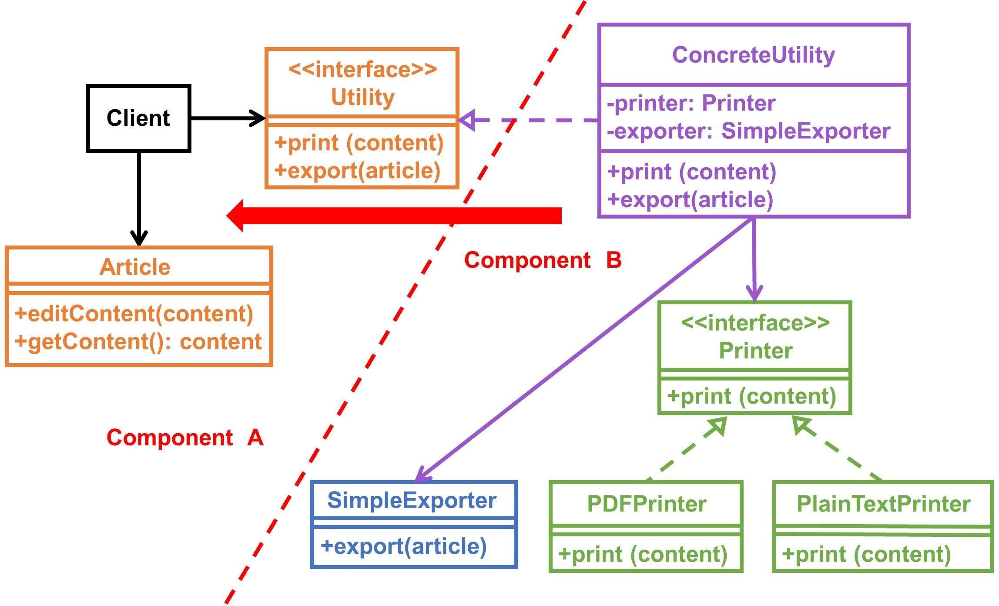
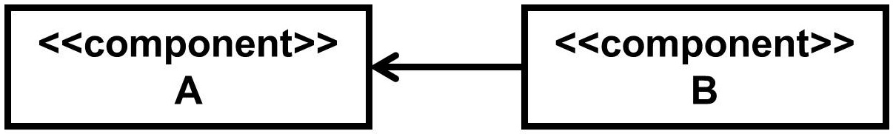
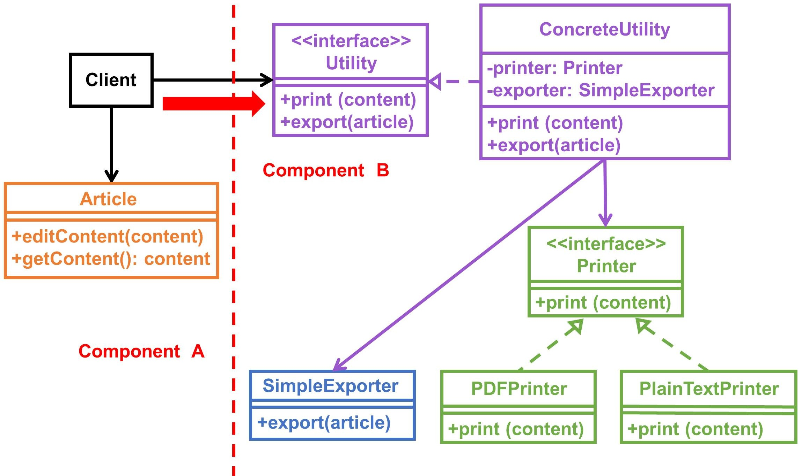
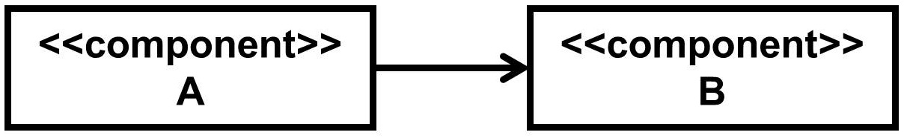
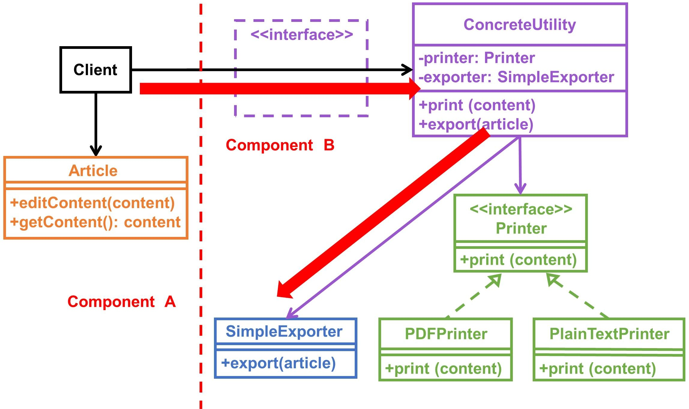

此篇文章偏重於以圖解方式，簡單帶大家了解 **開放封閉原則** 哦，有興趣就往下看吧！

OCP 為 Open Closed Principle 簡寫，均意為開放封閉原則。

👍 **若開發途中有持續遵循 [SRP](/posts/oo-single-responsibility-principle) 及 [DIP](/posts/oo-dependency-inversion-principle) 原則的話，其實你會發現程式也漸漸會符合 OCP 原則哦！**

❗️ 不過上述屬於比較理想的狀況，主要還是得看設計者當初的設計考量。

## 定義

以下擷取自 wikipedia

> 1. A module will be said to be open if it is still available for extension. For example, it should be possible to add fields to the data structures it contains, or new elements to the set of functions it performs.
> 2. A module will be said to be closed if is available for use by other modules. This assumes that the module has been given a well-defined, stable description (the interface in the sense of information hiding).

1️⃣ 模組因為是**可擴充**的情況，所以可以稱之為**開放**。比如像是在**資料結構中新增欄位**或是**功能新增一些元素（原有行為不變動情況下）**。

2️⃣ 模組因為是**可被其它模組使用**的情況，所以可以稱之為**封閉**。（**假設前提是 A 模組已經實作完 B 模組某種程度的需求，換句話說 B 模組不用特別再實作一次相同需求，而是使用 A 模組即可！**）

❓ **其中 2️⃣ 當中提到模組之間如何做到[資訊隱藏（Information hiding）](https://en.wikipedia.org/wiki/Information_hiding)？關鍵就在使用介面！回頭再來告訴各位。**

## 見解

從定義看兩點總結：**對外要可擴充，對內則避免修改，而對象可以是模組、類別、函式···等等。**

而我會用「**行為**」來當依據判斷，你一定也會希望原本正常的行為，經過你的修修改改後也要能夠繼續維持住，而如果真是如此，其實我覺得這也沒有實質打破 OCP 原則。

    ···

舉例來說，今天我有從**本地上傳檔案至遠端的行為（先假設沒有規定檔案大小）**，所以當使用者需要上傳時，系統就給他上傳，結果某一天遠端伺服器的容量直接炸了。

這時可能就會接到一個新需求，而需求內容則是「**系統上傳檔案前先判斷檔案大小，才決定可不可以上傳至遠端伺服器**」。

而當你**修改程式並加上這一判斷邏輯**後，可能會有兩種狀況發生：

1. 上傳行為**如同既往**（只是多了判斷檔案大小邏輯）
2. 上傳行為**出現異常**

如符合第一點描述，其實我認為這就沒有實質打破 OCP 原則，反之才可能要思考是不是當初分離職責（SRP）就沒有做好···等等其它因素。

## 類別圖 & 元件圖探討

接下來要仔細看囉，這邊開始會探討介面（Interface）的位置變動會造成什麼影響？！

這邊探討的範例都是從 [SRP](/posts/oo-single-responsibility-principle) 最後討論出來的方案 C（Plan C）下去變動。

### 注意看 Utility 介面位置變動！

1️⃣ 如果**將 Utility 介面移動到元件 A**，會發生什麼事？

✔️ 元件之間會符合 DIP 原則！

類別圖：

元件圖：

從兩元件之間的關係來看，元件 A 層次比較高，而元件 B 層次就相對於元件 A 低，所以也可以解讀成「**元件 A 的改變不會影響元件 B**」，對於元件 A 來說，只要給我符合 Utility 介面定義的元件即可（**元件 B 有可替換性**）！

    ···

2️⃣ 如果**將 Utility 介面移動到元件 B**，會發生什麼事？

✔️ 符合**資訊隱藏**特性！

❌ 元件之間沒有符合 DIP 原則！

類別圖：

元件圖：

與第一種情況不同，元件之間的依賴關係相反了，元件 B 變成比較高層次，而元件 A 相較於元件 B 低，可以解讀成「**元件 A 若沒有元件 B 有可能會無法正常運作**」，**元件 A 如果是系統中較重要的核心，應該都要盡量避免這種依賴關係！**

❗️ 接著從另一個角度來看**資訊隱藏**這件事，為什麼會符合？

**因為元件 A 只知道可以呼叫 export 函式來匯出文章，但是它不曉得實際上是透過 SimpleExporter 完成這件事···**

換句話說，元件 B 很大程度上在給別人使用時，沒有透漏太多資訊給元件 A 知道，只是跟它說我應該怎麼用而已～

    ···

3️⃣ 如果**拿掉 Utility 介面**，會發生什麼事？

❌ 沒有符合資訊隱藏特性！

❌ 元件之間沒有符合 DIP 原則！

類別圖：

元件圖：

元件圖和第二種情況一樣，但**唯一的不同是拔掉了元件 B 內的 Utility 介面**，這時就**發生了遞移依賴關係**。

😱 遞移依賴：依賴了本不應該依賴的，這種依賴關係應該要消除！

仔細看你會發現**元件 A 知道可以呼叫 export 函式來匯出文章，但它同時也知道是透過 SimpleExporter 完成這件事···**

## 總結

這樣你就清楚為什麼要**單獨把介面放在高層次元件位置**，而**低層次元件通常放易變動的具體實作**，主要就是幫**元件之間做解耦動作**，這樣一來**低層次元件就有機會可以被替換**，而**不影響高層次元件**哦！

但**倘若利用介面不是達到元件之間解耦**，那就有**可能是想要達到資訊隱藏的目的**哦！

## 結尾

感謝各位花時間看完此篇文章，如果本文中有描述錯誤，還請各位指教。

希望這篇文章可以讓大家了解 Open Closed Principle，不過話說回來，若要完全遵循 OCP 精神，系統某種程度上會變複雜許多（複雜是指檔案數量可能會變多，更何況是介面會在元件之間游移），所以如果能夠畫出類別圖，甚至是元件圖，都將有助於了解系統整體的架構規劃！
