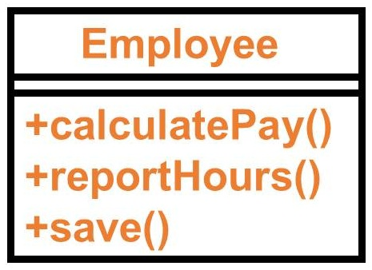
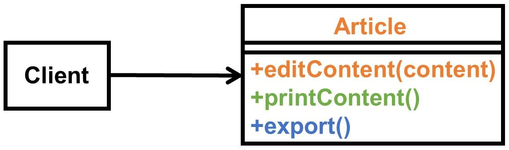
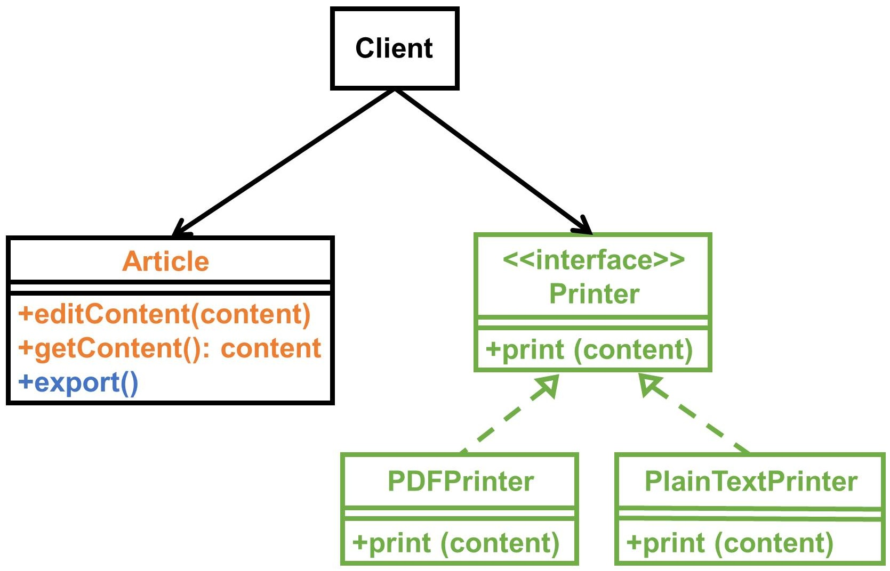
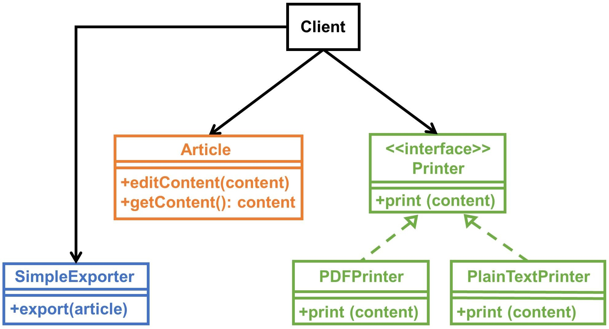
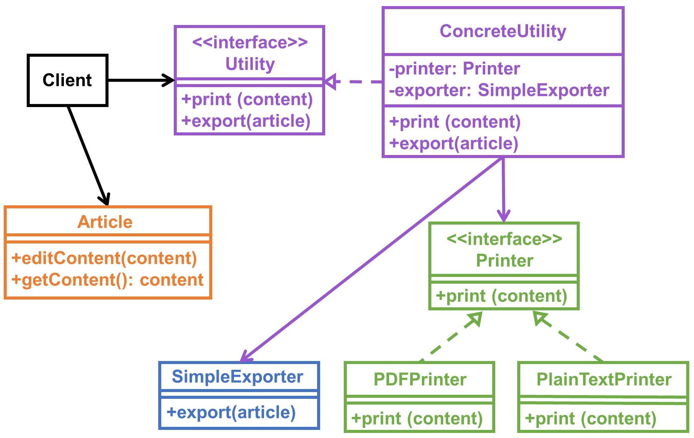

此篇文章偏重於以圖解方式，簡單帶大家了解 **單一職責原則** 哦，有興趣就往下看吧！

SRP 為 Single Responsibility Principle 簡寫，均意為單一職責原則。

👍 **開發途中若有遵循此原則將有助於使類別往高內聚低耦合發展哦！**

❓ 為何分離職責這件事很重要，回頭再來告訴各位。

## 定義

以下擷取自 [wikipedia](https://en.wikipedia.org/wiki/Single_responsibility_principle)

> A reason to change.

改變應只為一個理由！

## 見解

從**單一職責**這幾個字來看，你可能會覺得是「一個類別或模組只能做一件事」，我當初也是這樣認為…

讀了《Clean Architecture》 中對於 SRP 的描述，重新認識到應將上面「一個類別或模組只能做一件事」，修飾為「**一個類別或模組應只對於一個角色（Actor）負責**」。

書中提及的例子是關於 Employee 類別職責，如下圖：



當**維護 Employee 類別的不只一種角色**時，會發生什麼事？

先假設情境為工程師被要求需要寫出：

- 符合**會計人員需求**的 calculatePay 方法
- 符合**人資人員需求**的 reportHours 方法
- 符合**資料庫管理員需求**的 save 方法

很明顯這個類別已經違反了 SRP，因為它執掌太多職責了…

**更慘的是假設今天只要上述其中一個需求有了異動，有沒有可能導致其餘兩種人員功能使用上出現狀況？有很大機會！**

書中則有提出幾種解法，詳細可以去買來看看，這邊就不多做說明了。

## 類別圖探討

舉個就近的例子，比如在 Blog 發文這件事，一開始我可能會思考文章需要哪些功能？

應該要可以**編輯、顯示、匯出**文章，如下圖方案 A：



<center>
    Plan A
</center>

Client 端你可能會這樣寫：

```typescript
class Client {

    private article: Article;

    constructor(article: Article) {
        this.article = article;
    }

    // 編輯文章
    public editArticle(content: string): void {
        // 編輯文章內容
        this.article.editContent(content);
    }

    // 顯示文章
    public printArticle(): void {
        // 顯示文章內容
        this.article.printContent();
    }

    // 匯出文章
    public exportArticle(): void {
        this.article.export();
    }
}
```

你可能已經發現了，以**目前來看 Article 類別掌握太多職責，所以已經違反 SRP！**

<center>
    ···
</center>

接著我們可以開始思考有哪些角色會來操作這些功能？

- 編輯文章：文章作者（無法自行匯出文章）
- 顯示文章：文章編輯器
- 匯出文章：編輯

**角色並不一定要是真實存在的人，特別注意！**

然後依據剛剛所思考的將方案 A 調整為方案 B，如下兩張圖：

1️⃣ 先將**顯示的責任抽出來給 Printer，要怎麼樣顯示出文章內容就由你來決定吧！**



<center>
    Plan B - 1
</center>

2️⃣ 則將**匯出的責任交給 SimpleExporter，透過什麼樣的方式來下檔就交給你了！**



<center>
    Plan B - 2
</center>

Client 端改寫成這樣：

```typescript
class Client {

    private article: Article;
    private printer: Printer;
    private exporter: SimpleExporter;

    constructor(article: Article) {
        this.article = article;
        this.printer = new PlainTextPrinter();
        this.exporter = new SimpleExporter();
    }

    // 編輯文章
    public editArticle(content: string): void {
        // 編輯文章內容
        this.article.editContent(content);
    }

    // 顯示文章
    public printArticle(): void {
        // 顯示文章內容
        this.printer.print(this.article.getContent());
    }

    // 匯出文章
    public exportArticle(): void {
        this.exporter.export(this.article);
    }
}
```

**現在 Article 類別只專注於操作文章，而顯示及匯出的職責都被分離出來了。**

所以當我哪天要調校顯示或匯出功能，我都不用擔心操作文章的功能會被影響哦！

這就是遵循 SRP 所帶來的結果，**一個職責只會因為一個理由而改變**。

## 為什麼要分離職責？

當你將類別分離職責的越清楚，類別將會愈符合**高內聚低耦合**的特性。

高內聚：因類別職責相當清楚（哪天匯出功能發生問題，直接直搗黃龍）。

低耦合：類別需要 include 的數量降低（因分離職責關係，就有機會將特定職責類別集中管理，像是透過外觀模式就能做到減少 include 數量，等等就會提到了）。

## 延伸

從方案 B 的 Client 端程式碼來看，當我一直加入與操作文章、顯示、匯出無關的新職責時，Client 端程式碼有可能會越來越複雜，那有沒有什麼樣的方式可以做個調整？

更何況是當顯示、匯出等細部邏輯都各自寫在不同元件，Client 端應該要怎麼處理？

接著我們談談**外觀模式（Facade pattern）**。

## 外觀模式

接著我們在將方案 B 調整成方案 C，如下圖：



<center>
    Plan C
</center>

Client 端再改寫成這樣：

```typescript
class Client {

    private article: Article;
    private utility: Utility;

    constructor(article: Article) {
        this.article = article;
        this.utility = new ConcreteUtility();
    }

    // 編輯文章
    public editArticle(content: string): void {
        // 編輯文章內容
        this.article.editContent(content);
    }

    // 顯示文章
    public printArticle(): void {
        // 顯示文章內容
        this.utility.print(this.article.getContent());
    }

    // 匯出文章
    public exportArticle(): void {
        this.utility.export(this.article);
    }
}
```

套用外觀模式（Facade pattern）後，你會發現 Client 端切離了 Printer 和 SimpleExporter 明確的依賴關係，而這樣的依賴關係變成由 ConcreteUtility 來承擔，Client 端只需知道引用（include）具體工具元件達成外部需求就行！

## 參考

💭 [PHP OO 物件導向原則:單一職責原則SRP](https://wadehuanglearning.blogspot.com/2017/08/php-oo.html)

## 結尾

感謝各位花時間看完此篇文章，如果本文中有描述錯誤，還請各位指教。

希望這篇文章可以讓大家了解 Single Responsibility Principle，若在開發時就盡可能遵循該原則，將能寫出高內聚低耦合的類別，間接影響就是逐步降低元件之間的耦合關係，棒棒！
