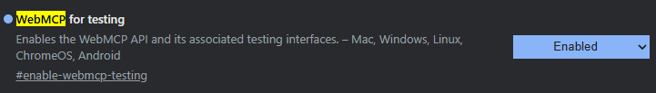
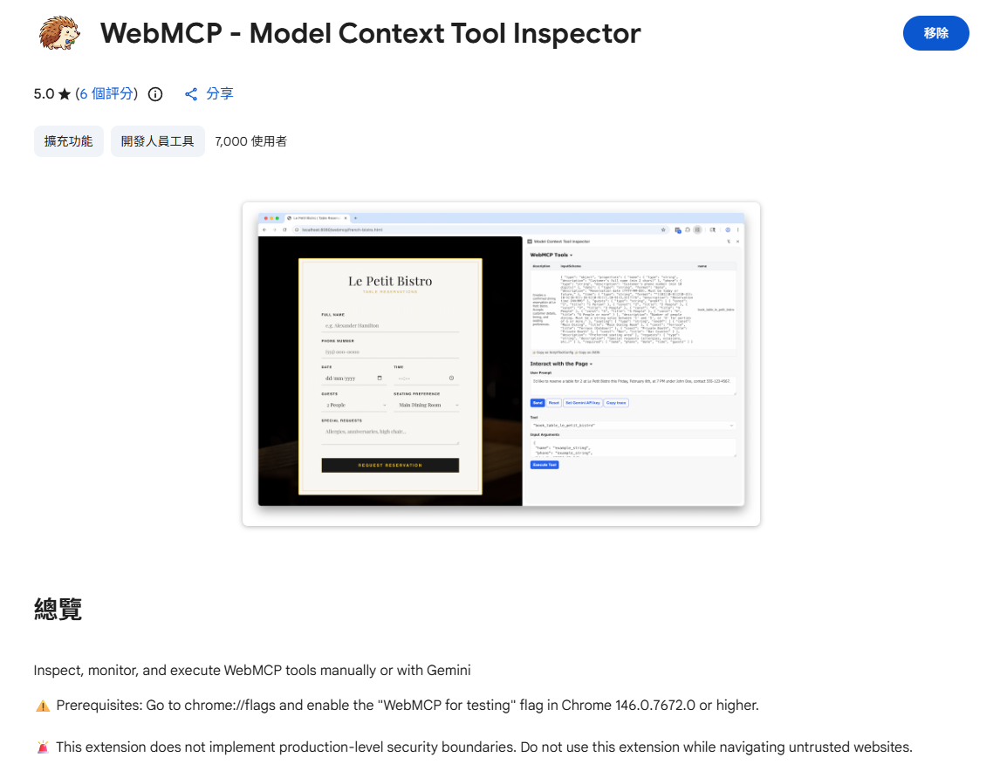
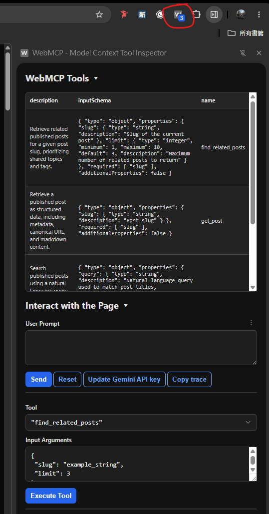

## 前言

過去網站主要是為人類設計的。

人類會打開頁面、閱讀導覽、點擊連結、使用搜尋框，然後在不同文章之間移動。這樣的互動模式對人來說很自然，但對 AI 代理（Agent）來說卻不一定有效。

💥 **如果 Agent 只能透過畫面截圖或 DOM 結構猜測網站能做什麼，它就很容易受到 UI 變動、文案差異或頁面結構影響。**

✨ **WebMCP 想解決的問題，正是讓網站可以主動宣告自己有哪些能力，並以結構化工具的方式提供給 Agent 使用。**

這次我在自己的部落格中導入了 WebMCP，並實作了三個工具：

- `search_posts`
- `get_post`
- `find_related_posts`

⚡ **目標是讓相容的 AI Agent 可以搜尋文章、取得文章內容，以及找到延伸閱讀。**

## 什麼是 WebMCP？

WebMCP 是一個新的 JavaScript Interface，讓網站開發者可以把網站功能暴露成「工具」。這些工具包含自然語言描述與結構化 Schema，並可被 Agents、Browser Agents 或輔助技術呼叫。

👉 Chrome Developers 對 WebMCP 的描述是：**提供一種標準方式公開 Structured Tools，讓 AI Agent 能以更高速度、可靠性與精準度在網站上執行動作。**

換句話說，WebMCP 不是讓 Agent 更努力地「看懂」網站，而是讓網站主動告訴 Agent：

> 我能做什麼、需要哪些參數、會回傳什麼結果

對部落格來說，這不一定是「執行動作」，也可以是「讀取內容」。例如：

```txt
search_posts → 搜尋文章
get_post → 取得文章內容
find_related_posts → 找延伸閱讀
```

這些都是部落格原本就有的能力，只是透過 WebMCP 包裝成 Agent 可以直接呼叫的工具。

## WebMCP 註冊方式

WebMCP 目前主要有**兩種註冊方式**：

- Declarative API：透過 HTML 或 Metadata 宣告其能力
- Imperative API：透過 JavaScript 動態註冊工具

💡 **這次我選擇使用 Imperative API，因為它能更靈活地控制工具註冊、資料取得與執行，對內容網站來說也比較容易整合既有搜尋與文章系統。**

WebMCP 的主要入口是：

```ts
document.modelContext
```

網站可以透過 `document.modelContext.registerTool()` 註冊工具。

一個工具通常會包含：

- `name`
- `description`
- `inputSchema`
- `execute`
- `annotations`

例如：

```ts
const controller = new AbortController();

document.modelContext.registerTool(
  {
    name: 'get_post',
    description: 'Retrieve a published blog post by slug.',
    inputSchema: {
      type: 'object',
      properties: {
        slug: {
          type: 'string',
          description: 'The post slug'
        }
      },
      required: ['slug'],
      additionalProperties: false
    },
    annotations: {
      readOnlyHint: true
    },
    execute: async ({ slug }) => {
      const response = await fetch(`/api/webmcp/posts/${slug}`);
      return await response.json();
    }
  },
  {
    signal: controller.signal
  }
);
```

❗ **WebMCP 目前仍屬早期階段**，故我把它當成一種漸進式增強功能。

**支援 WebMCP 的環境會註冊工具；不支援的環境則什麼都不做**，既有功能都不會受到影響。

```ts
if (!document.modelContext) {
  return;
}
```

## 人類操作 vs. Agent 操作

人類使用網站時，通常是這樣：

```txt
打開首頁
→ 看導覽
→ 使用搜尋
→ 點進文章
→ 閱讀內容
→ 自己判斷下一篇要看什麼
```

但 Agent 不需要模擬完整的人類操作流程。

對 Agent 來說，更理想的方式是：

```txt
search_posts
→ 找到相關文章

get_post
→ 取得文章內容

find_related_posts
→ 找到下一步閱讀方向
```

🔥 **這就是我覺得 WebMCP 有價值的地方。**

它不是取代 UI，而是替網站增加另一層介面：

```txt
Human Layer:
給人看的頁面、排版、導覽與互動

Agent Layer:
給 Agent 呼叫的工具、Schema 與結構化資料
```

🔎 **對內容網站來說，這層 Agent Layer 特別適合做成 read-only 工具。它不需要讓 Agent 修改資料，也不需要開放危險操作，只要讓 Agent 能穩定取得公開內容即可。**

雖然 WebMCP 的工具可以是 read-write，但對內容網站來說，read-only 就已經很有價值了。

## 實務經驗

這次我實作的三個工具都只讀取已發佈文章。

它們分別對應三個問題：

```txt
search_posts:
站上有沒有跟這個問題相關的內容？

get_post:
取得這篇文章的內容，讓 Agent 可以閱讀與分析。

find_related_posts:
看完這篇後，下一篇該看什麼？
```

### search_posts

用自然語言、主題 Slug、標籤 Slug 來搜尋文章。

> 範例：幫我查詢 WebMCP 相關的文章

```ts
search_posts({
  query: 'WebMCP',
  limit: 5
});
```

如果沒有提供任何條件，則回傳最近發佈的文章。

```ts
search_posts({
  limit: 5
});
```

回傳結果類似：

```json
{
    "mode": "search",
    "results": [
        {
            "slug": "website-webmcp-agent-tools",
            "title": "讓網站支援 WebMCP：為 AI Agent 提供可呼叫的工具",
            "description": "透過 WebMCP 讓 AI Agent 以結構化工具搜尋、讀取與探索部落格內容",
            "topic": "artificial-intelligence",
            "tags": ["ai-agent", "website", "webmcp"],
            "date": "2026-05-20",
            "url": "https://example.com/posts/website-webmcp-agent-tools"
        }
    ],
    "total": 1
}
```

目前實作上也能接受主題名稱與標籤名稱，處理上會先解析成對應 Slug 再做比對。

**設計上較能容錯，因為你永遠不會知道 AI 會怎麼輸入 ... 😅**

### get_post

用 Slug 取得單篇文章內容。

> 範例：那你可以針對 "讓網站支援 WebMCP：為 AI Agent 提供可呼叫的工具" 的內文進行一些總結嗎？

```ts
get_post({
  slug: 'website-webmcp-agent-tools'
});
```

回傳結果類似：

```json
{
    "metadata": {
        "slug": "website-webmcp-agent-tools",
        "title": "讓網站支援 WebMCP：為 AI Agent 提供可呼叫的工具",
        "description": "透過 WebMCP 讓 AI Agent 以結構化工具搜尋、讀取與探索部落格內容",
        "date": "2026-05-20",
        "drafted": false,
        "featured": true,
        "topic": "artificial-intelligence",
        "tags": ["ai-agent", "website", "webmcp"],
        "authors": ["neil-tsai"]
    },
    "url": "https://example.com/posts/website-webmcp-agent-tools",
    "content": "# 讓網站支援 WebMCP..."
}
```

目前實作上沒有讓它直接回傳整個 HTML，也沒有讓 Agent 須要自己拆 Frontmatter，而是回傳 Structured JSON。

👍 **這樣 Agent 拿到的不只是頁面，而是一份更穩定的內容資料。**

### find_related_posts

用來尋找延伸閱讀資源。

> 範例：那目前有什麼可以延伸閱讀的資源嗎？

```ts
find_related_posts({
  slug: 'website-webmcp-agent-tools',
  limit: 3
});
```

目前實作上的排序邏輯很單純：

1. 排除目前文章
2. 同主題會拿到較高分
3. 每個共享標籤都會再增加分數
4. 分數相同時，再用日期排序作為平手決勝（Tiebreaker）

回傳結果類似：

```json
{
    "source": {
        "slug": "website-webmcp-agent-tools",
        "title": "讓網站支援 WebMCP：為 AI Agent 提供可呼叫的工具",
        "description": "透過 WebMCP 讓 AI Agent 以結構化工具搜尋、讀取與探索部落格內容",
        "topic": "artificial-intelligence",
        "tags": ["ai-agent", "website", "webmcp"],
        "date": "2026-05-20",
        "url": "https://example.com/posts/website-webmcp-agent-tools"
    },
    "total": 36,
    "results": [
        {
            "slug": "artifact-driven-ai-workflows",
            "title": "Artifact-Driven AI Workflows：讓 AI 協作從對話變成可執行流程",
            "description": "說明如何用 artifact 驅動 AI 協作流程，讓需求、規格與實作之間建立可持續演進的連結。",
            "topic": "artificial-intelligence",
            "tags": ["ai-agent"],
            "date": "2026-05-05",
            "url": "https://example.com/posts/artifact-driven-ai-workflows",
            "reason": "Same topic (Artificial Intelligence) and shared tags: AI Agent"
        }
    ]
}
```

🔎 **我讓結果還包含 `reason`，因為 Agent 不只需要結果，也需要知道為什麼推薦這篇文章。**

## 偵錯方式

1. 你必須在 `chrome://flags` 中啟用 "WebMCP for testing" 功能，才能在 Chrome 146.0.7672.0 或更高版本中來偵錯。
   
2. 安裝 [WebMCP - Model Context Tool Inspector](https://chromewebstore.google.com/detail/webmcp-model-context-tool/gbpdfapgefenggkahomfgkhfehlcenpd)。（[來源](https://github.com/beaufortfrancois/model-context-tool-inspector)）
   
3. 點擊擴充功能圖示，打開工具檢視器，然後在你的網站上測試工具呼叫。
   

如果你進到某個網站，擴充功能圖示有寫明數字（例如 "3"），代表該網站已註冊了三個工具，你就可以在工具檢視器中看到它們並測試呼叫。

就我目前所知，[Yahoo 拍賣](https://tw.bid.yahoo.com) 其實已經有悄悄的導入 WebMCP 了，而且目前有 2 個工具：

- `product_search`：搜尋拍賣商品
- `store_search`：搜尋賣家商店

> 範例：幫我找找 500 元以下的行動電源

實際行為：它的網站真的會帶你到搜尋結果頁，然後把搜尋條件帶過去。

✨ 這也是我覺得 WebMCP 很有潛力的地方：**它不只適合內容網站，也很適合電商、論壇、社交平台等各種網站類型。**

## 搭配 /llms.txt

我的部落格原本就有 `/llms.txt`，所以我也在裡面補上 WebMCP 的能力描述。

```md
## WebMCP

These tools provide structured, read-only access to published blog content.

When WebMCP is available, compatible AI agents can access the following tools:

- `search_posts(query?, topic?, tag?, limit?)`  
  Search published posts using a natural language query, topic name or slug, or tag name or slug. When no filters are provided, this tool returns the most recently published posts.

- `get_post(slug)`  
  Retrieve a published post as structured data, including metadata, canonical URL, and markdown content.

- `find_related_posts(slug, limit?)`  
  Retrieve related published posts for a given post slug, prioritizing shared topics and tags.
```

我對 `/llms.txt` 和 WebMCP 的定位是：

```txt
/llms.txt:
告訴 AI 這個網站有哪些內容與能力

WebMCP:
讓相容環境中的 Agent 可以直接呼叫工具
```

✨ **兩者不是互相取代，而是互補。**

`/llms.txt` 偏靜態說明，WebMCP 則提供動態工具介面。

## 結語

這次實作後，我覺得 WebMCP 工具設計有一個蠻重要的原則：能力要聚焦。

💡 **每個工具不需要試圖完成一整段複雜流程，而是應該維持單一職責，提供清楚、穩定、可組合的能力。**

例如這次的三個工具：

- `search_posts` 負責發現內容
- `get_post` 負責取得內容
- `find_related_posts` 負責延伸探索

它們各自都很小，但 Agent 可以把它們組合起來，完成更複雜的行為，例如**回答問題、整理文章脈絡或建立一條閱讀路徑**。

因此，WebMCP 的重點不只是「讓網站多幾個 API」，而是替網站設計一組 Agent 可以理解、信任並自由組合的能力介面。

對內容網站來說，這是一個很適合漸進嘗試的方向。既有的人類介面仍然保留，搜尋、SEO、`/llms.txt` 也不需要被取代；WebMCP 則像是在網站旁邊新增一層 Agent Layer，讓相容環境中的 AI Agent 可以用更結構化的方式存取內容。

目前 WebMCP 仍在早期階段，所以我不會把它視為必要功能，而是把它當成漸進式增強功能：支援時就提供更好的 Agent 操作體驗，不支援時網站也照常運作。

✨ **未來的網站可能不只需要給人類看的 UI，也會需要給 Agent 使用的工具層。而 WebMCP，正是這個方向的一個有趣起點。**

## 參考

💭 [WebMCP](https://webmachinelearning.github.io/webmcp)

💭 [WebMCP is available for early preview](https://developer.chrome.com/blog/webmcp-epp)

💭 [Collection of WebMCP tools](https://github.com/GoogleChromeLabs/webmcp-tools)

💭 [WebMCP：當網站不再需要被「看」，而是被「呼叫」](https://www.oao.tw/ai-knowledge/webmcp)

💭 [[前端開發] WebMCP 介紹與實作：讓 AI Agent 無縫操作你的網頁](https://yishiashia.github.io/posts/webmcp-introduction)
