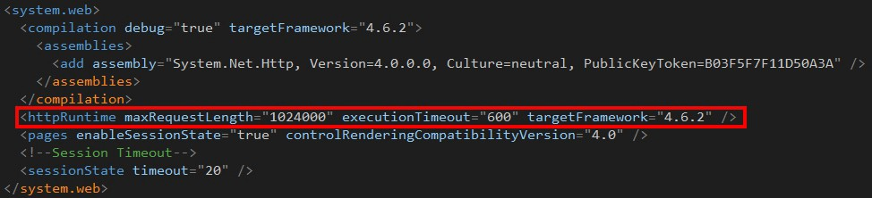
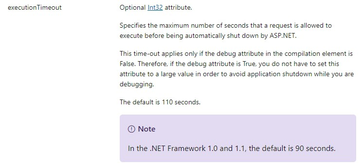
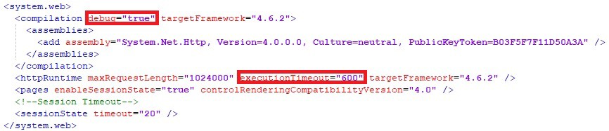
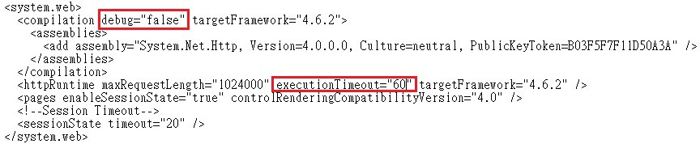
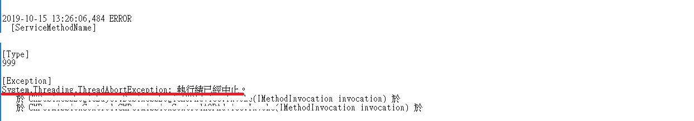
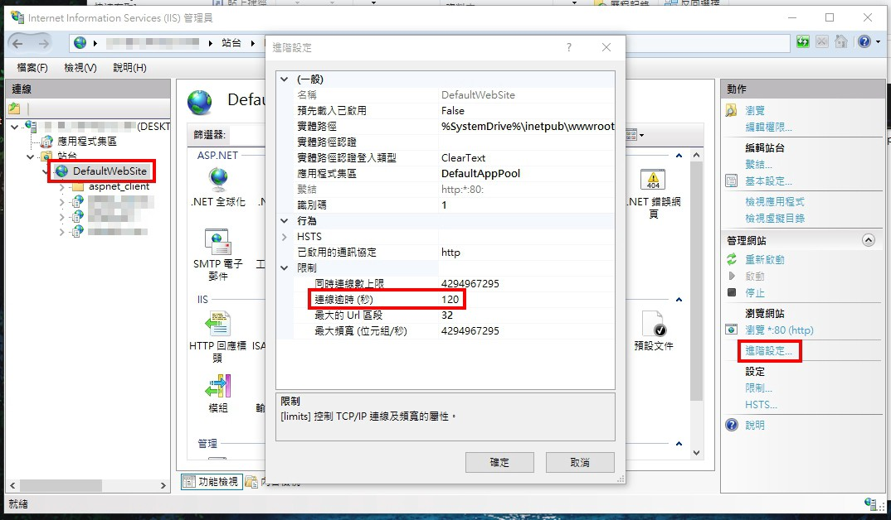
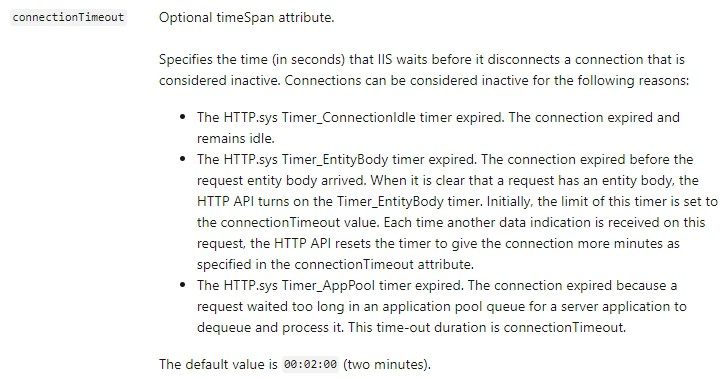

## 前言

最近在公司協助解決問題時，碰到一個問題描述為「**前端發 Request 1分鐘後就會回傳失敗**」且是在**客戶環境**，聽到的狀況是 **Response 回傳 Http status 為 504**，所以就有**初步懷疑可能是客戶網路有什麼限制···**

💭 [504 Gateway Timeout Error](https://www.lifewire.com/504-gateway-timeout-error-explained-2622941#targetText=The%20504%20Gateway%20Timeout%20error,another%20request%20by%20the%20browser)

不過當然身為工程師，還是得要窮盡可能去嘗試看看自己是否有哪邊沒有做到位，於是乎我先把遇到的狀況同步給對方 IT 幫忙看看是否能排除問題···

回到主題，我一開始還真的不清楚 executionTimeout 和 connectionTimeout 的區別是什麼 Σ(ﾟДﾟ；≡；ﾟдﾟ) 查了一些資料才比較明白···

## 👉 ExecutionTimeout

> web.config > system.web > httpRuntime

    web.config

    Microsoft Docs

**有幾點可以特別注意：**

1. 長度限制為有號 32 位元。
2. 可以決定 Server 端針對這一 Request 最大能處理的時間。
3. Compilation 元素內的 debug 屬性會影響其生效。
4. 因 .NET Framework 版本預設值會有差異。

### 實際小演練

> debug = true

   web.config

**開發環境我不希望發生有執行逾時(Execution Timeout)的情況發生**，所以 Compilation 元素內的 debug 屬性設為 True。

> debug = false

    web.config

**測試環境我希望發生有執行逾時(Execution Timeout)的情況發生**，所以 Compilation 元素內的 debug 屬性設為 False。

    Logged message

如果這個要求(Request)在 Server 超過 executionTimeout 所設置的時間，則會回傳 Http status 500 給前端。

### 參考來源

💭 [httpRuntime Element (ASP.NET Settings Schema)](https://docs.microsoft.com/en-us/previous-versions/dotnet/netframework-4.0/e1f13641(v=vs.100)?redirectedfrom=MSDN#Anchor_0)

💭 [compilation Element (ASP.NET Settings Schema)](https://docs.microsoft.com/en-us/previous-versions/dotnet/netframework-4.0/s10awwz0(v=vs.100))

💭 [ASP.NET MVC 開發心得分享 (22)：關於 executionTimeout](https://blog.miniasp.com/post/2011/09/08/ASPNET-MVC-Developer-Note-Part-22-About-httpRuntime-executionTimeout)

## 👉 ConnectionTimeout

> IIS 網站(Site) > 進階設定(Advanced Settings) > 連線限制(Connection Limits)

    IIS

    Microsoft Docs

**有幾點可以特別注意：**

1. 可以決定 client 與 server 建立的 TCP 連線在中斷前可保持非使用中的時間。(簡單說就是這條被建立的連線在非活耀狀態下可以持續的時間，過後則關閉連線)
2. 描述三種狀況會被視為非活耀連線狀態
3. 預設為 120 秒(2 分鐘)

### 參考來源

💭 [Default Limits for Web Sites &lt;limits&gt;](https://docs.microsoft.com/en-us/iis/configuration/system.applicationHost/sites/siteDefaults/limits#005)

💭 [[IIS][ASP.net] 連線逾時，Session Timeout的設定](https://dotblogs.com.tw/shadow/2017/09/14/195114)

💭 [HTTP keep-alive連線](https://zh.wikipedia.org/wiki/HTTP%E6%8C%81%E4%B9%85%E8%BF%9E%E6%8E%A5)

## 結尾

感謝各位花時間看完此篇小文，如果本文中有描述錯誤，還請各位指教。

希望大家對於 executionTimeout 及 connectionTimeout 的定義可以做出區別並有初步認識，兩者並不是指同一件事情哦···

謎之聲：這個不是看英文就知道了(´･_･`)？

我：···