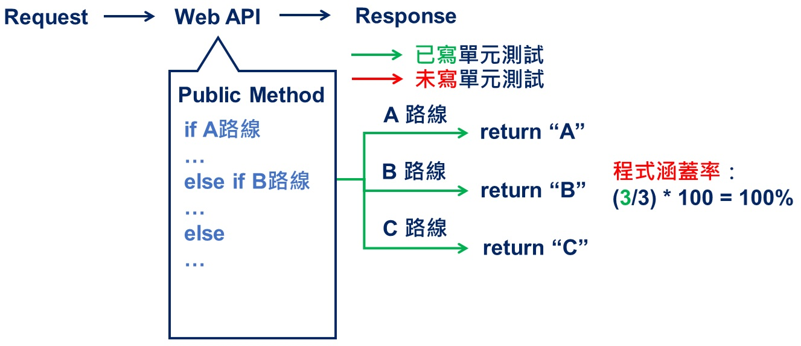
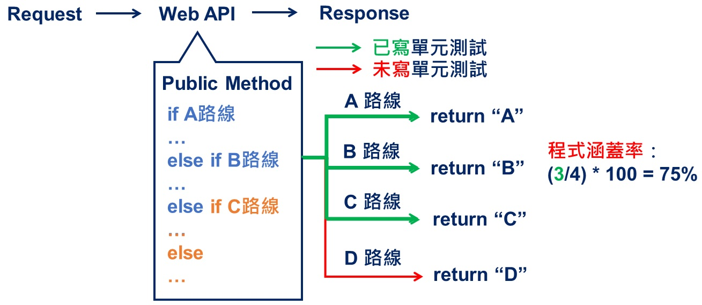
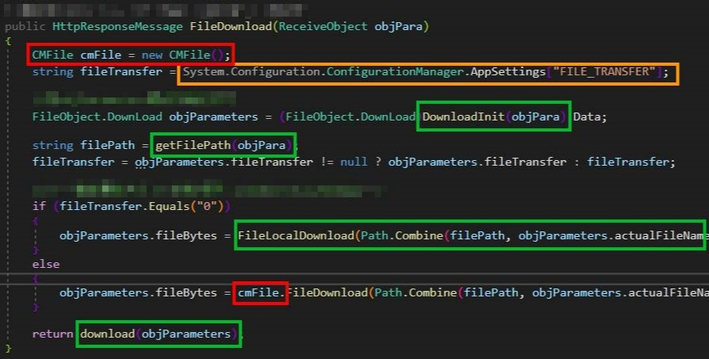
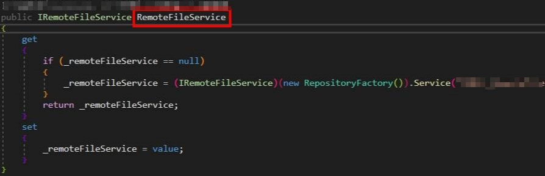
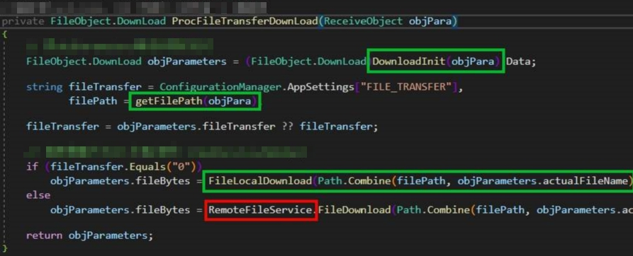
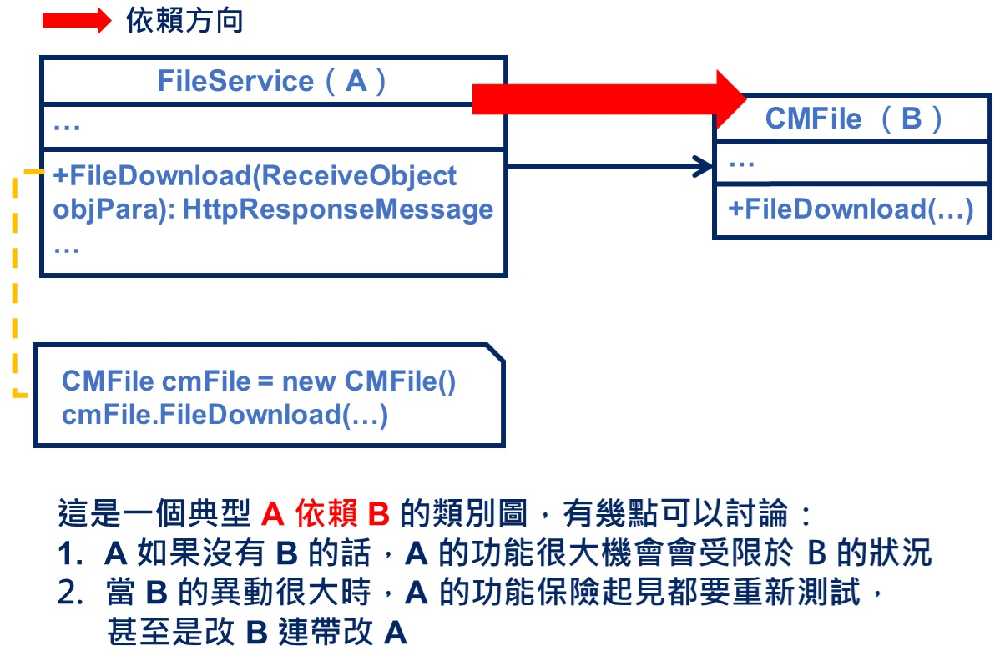
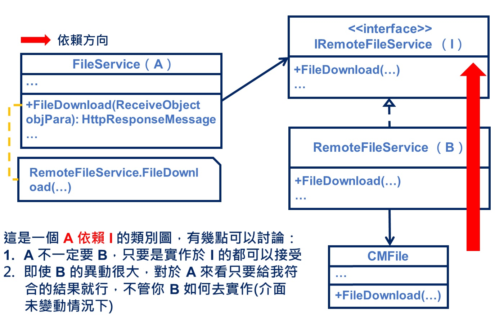
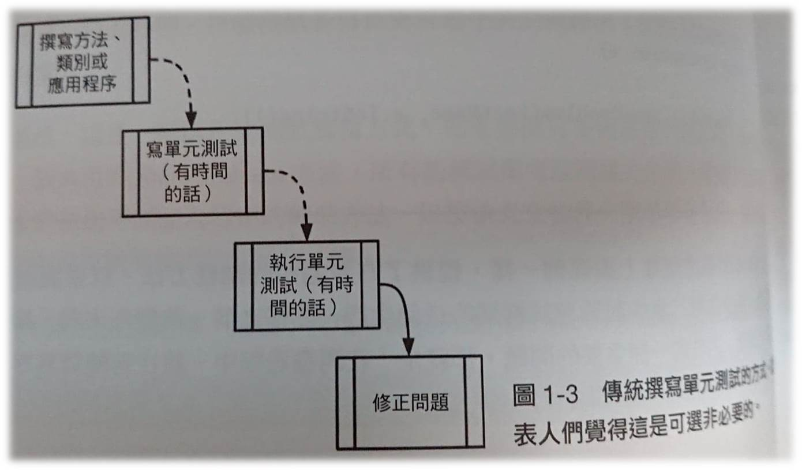
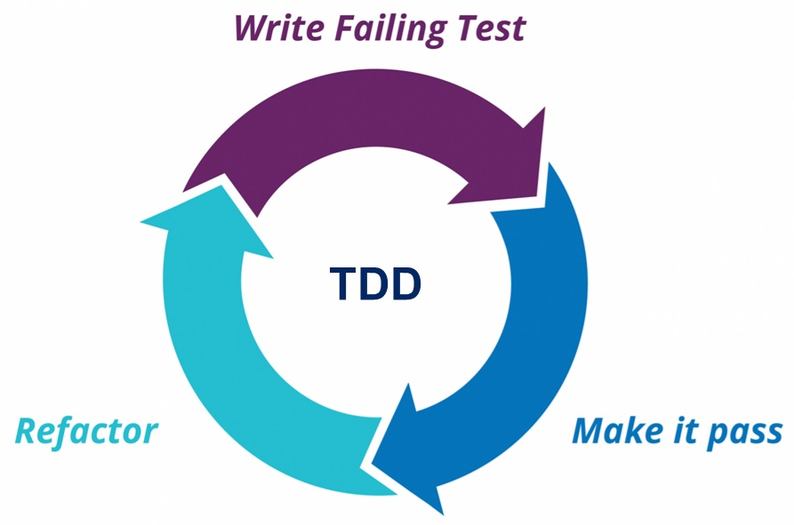
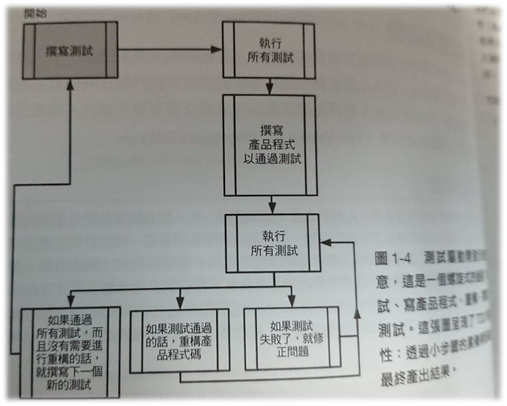

此篇文章主要帶大家**快速理解為什麼程式需要單元測試**，有興趣就往下看吧！

請先試想下列幾個問題：

1. 我們會因使用者需求，寫出可以跑的程式就好…
2. 某天來了一個新需求，這個需求會改到部分已經原有的程式，比較好的做法可能是以不影響原本程式邏輯的狀況下來擴充程式…
3. 時代在變，做法也在變，好想重構程式碼…
4. 我的程式是不是有幾行沒用到？

你/妳可能會這樣回答：

1. 這不是廢話嗎？時間就是金錢阿！
2. 如果修改程式會破壞原本的邏輯，我請你/妳來幹嘛 😂？
3. 沒有一個工程師不願意重構吧！？但礙於時程壓力，往往沒有重構的時間，懂嗎 😂？
4. 在時限內完成需求，就是完成任務啦！接著就開始下一個開發循環囉…

我的見解：

1. 若以時程考量來看，在時程內完成可以跑的程式我覺得沒什麼大問題，但我會建議一定還要寫單元測試出來！
2. 大多數情況下，不可能沒有新需求，客戶是貪婪的 😂！工程師為了完成需求，盡可能要在維持開放封閉原則情況下來修改程式…
3. 呼應第 1 點，若有寫完可以跑的程式搭配上幾個單元測試案例，之後就有時間可以重構！
4. 呼應第 3 點，在重構程式碼時，就可以找到一些程式碼異味（Code Smell）並處理！

上面講這麼多就是為了將各位帶入單元測試的**好**究竟在哪裡？總算要進入主題啦 😜

# 單元測試

## 介紹

👉 其實單元測試你/妳可以把它想像成走路線小遊戲…

**當今天有一個要求（Request）打了某一個 Web API，根據需求所撰寫的程式，是否有辦法走完每一條路線（使用案例）呢？**

下圖所示為程式碼涵蓋率 100% 的情況（代表每一路線均有走完）：

    Code coverage 100%

而當今天因為新需求，而有了新路線時，如下圖：

    Code coverage 75%

❗ **D 路線是因需求變化而產生，因為 D 修改的程式對於 A、B、C 來說則是不穩定的因素，需要特別留意…**

寫完單元測試後才漸漸明白它可以幫我們快速做[回歸測試（Regression Testing）](https://kkboxsqa.wordpress.com/2014/02/27/%E5%9B%9E%E6%AD%B8%E6%B8%AC%E8%A9%A6-regression-testing/)，D 測試寫出來，直接一併測 A、B、C、D，就能知道 D 的修改是否會影響 A、B、C 哦！

## 好處

- 改 A 壞 B 馬上現形
- 縮短開發者回歸測試時間
- 程式回傳變得可預期
- 程式愈符合物件導向設計原則
- 容易快速重構程式碼
- 排除過度設計的程式碼
- 降低程式過度耦合

## 難處

- 對於一個**未曾有過撰寫單元測試經驗的開發者**來說，**撰寫單元測試所耗用的時間可能會大於實際撰寫程式碼的時間**，因為思維會變成「撰寫可測試程式的測試程式」，所以多數人會選擇放棄撰寫單元測試…
- 需先判斷**是否有寫單元測試的價值才去寫**，因為對於**需求不確定、價值性不高去寫反而會浪費時間**，因為**需求變動，勢必單元測試程式也會變動**

## 實例探討

### 改變前

以檔案下載（FileDownload）這支公開（Public）方法來看，你/妳可能會這麼寫：

    FileDownload before

若要嘗試測試該方法，需要先意識到幾件事：

1. 以程式碼最小單位來進行測試
    - DownloadInit、getFilePath、FileLocalDownload、download 這些私有（Private）方法均屬於構成檔案下載行為的一部分
2. 找出外部影響（需要 [Mock](https://en.wikipedia.org/wiki/Mock_object) 的對象，因為不希望外部影響是不可控的）
    - System.Configuration.ConfigurationManager.AppSettings
    - CMFile

⭐ 了解這幾件事之後，接著就是把這些不可控的程式變得可預期，但怎麼變？

1. System.Configuration.ConfigurationManager.AppSettings
    - 想辦法讓它不去讀設定檔，而是透過執行測試程式途中去替換（方法很多）
2. CMFile
    - 非常不建議直接創建（new）實例，這樣寫就表示 CMFile 一旦有變化，FileDownload 該方法會變得非常不穩定（間接來說就是 FileService 和 CMFile 有耦合關係）

### 改變後

    Rely on IRemoteFileService

    FileDownload after

⭐ 經過調整後將 FileService 和 CMFile 解開了耦合，但怎麼解的？

透過定義一層新介面（IRemoteFileService）並實作它，將所有有關 CMFile 的實作集結於此，接著透過依賴注入（Dependency injection）來幫助我們產生實例 ，回過頭來看 FileDownload 居然變得可以依照預期來測試！

你可能會納悶為什麼有這樣的效果？**其實關鍵就是解開耦合，一旦程式耦合嚴重，基本上程式是沒有辦法寫單元測試出來，能夠寫出單元測試的程式，表示愈符合物件導向設計原則！**

### 從案例看依賴反轉原則（DIP）

    Rely on concrete class

    Rely on interface

若想知道更多依賴反轉原則概念的話，可參考我寫的「[依賴反轉原則 DIP｜夾心餅乾原則！？](/posts/oo-dependency-inversion-principle)」…

### 失敗原因

單元測試基本構成如下圖：

所以可以從以下幾點去找出問題所在：

1. 預期的輸入資料就有問題
2. 因需求變動的被測試程式並不符合測試程式預期
3. 調整完因需求變動的被測試程式，但未一併調整測試程式

## 開發流程衍生探討

### Traditional Development

    Traditional development

🔖 圖片出處：《**The Art of Unit Testing: with examples in C# Second Edition**》

傳統開發流程沒什麼好說的，非常直覺…

寫完程式 ➡️ 整合測試 ➡️ 發現問題 ➡️ 修正問題 ➡️ 整合測試 ➡️ … Loop

理想情況下，程式會越修越完善，但非常花費時間成本（短期其實看不出來）…

### Test-Driven Development, TDD

    Test-Driven Development

    Test-Driven Development

🔖 圖片出處：《**The Art of Unit Testing: with examples in C# Second Edition**》

測試驅動開發流程和傳統開發流程相比，差異可就大了！

直接先強制你/妳撰寫單元測試程式，然後依據該測試程式的預期來完成真正的程式，懵了吧 😂

❗ **但為什麼可行？回想一下單元測試可以幫助開發者達成什麼事？就是回歸測試！**

假設我要寫檔案上傳這一功能，可能的測試案例有以下這些：

1. 檔案大小限制
2. 檔案有無加密
3. 檔案上傳
4. ...

**寫好這些測試案例**後，接下來就是要**想辦法完成每一個測試案例的預期！**

⭐ 當這些預期被滿足後，很神奇地你/妳會發現寫的程式會符合以下幾點：

1. 程式碼很大程度均被涵蓋（程式涵蓋率）
2. 幾乎不會出現過度設計的狀況
3. 避免掉偏離物件導向設計原則（降低程式耦合）

神不神奇？雖然你/妳聽我這樣講可能沒什麼感覺，但以結果論來看，我認為測試驅動開發流程幾乎屌打傳統開發流程…

因為 TDD 把**寫測試這件事變成了前提**並且**很好的控制了程式短時間的擴展問題**（開發者總是思考的是程式彈性，但往往 API 介面都開得太多，剛好 TDD 可以抑制這種情況發生，把介面變動程度降低到最小）！

❗ 但老實說 TDD 並不是可以容易施行的開發流程，能不能透過一些工具來輔助與團隊成員之間的配合，這些都是比較關鍵的因素，需要特別留意！

若未來有機會迅速在專案導入 TDD，會在將經驗分享出來 XD…

先留一個洞給自己做準備～

## 參考

💭 [單元測試為什麼會這麼重要─成為優秀的軟體工程師](https://lakesd6531.pixnet.net/blog/post/348346657-%e5%96%ae%e5%85%83%e6%b8%ac%e8%a9%a6%e7%82%ba%e4%bb%80%e9%ba%bc%e6%9c%83%e9%80%99%e9%ba%bc%e9%87%8d%e8%a6%81%e2%94%80%e6%88%90%e7%82%ba%e5%84%aa%e7%a7%80%e7%9a%84%e8%bb%9f%e9%ab%94)

💭 [一次搞懂單元測試、整合測試、端對端測試之間的差異](https://blog.miniasp.com/post/2019/02/18/Unit-testing-Integration-testing-e2e-testing)

💭 [自動軟體測試、TDD 與 BDD](https://medium.com/@yurenju/%E8%87%AA%E5%8B%95%E8%BB%9F%E9%AB%94%E6%B8%AC%E8%A9%A6-tdd-%E8%88%87-bdd-464519672ac5)

